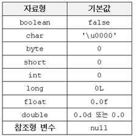
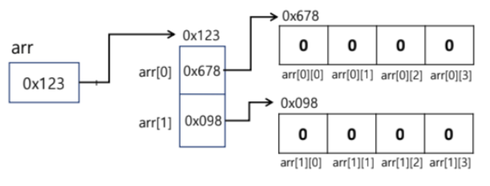

### Array(배열)
* 같은 타입의 여러 변수를 하나의 묶음으로 다루는 것<br>
* 배열의 각 요소는 메모리주소가 연속적이다.<br>
* 배열의 길이는 최초 선언한 값으로 고정되며 위와 같이 인덱스(Index)를 통해 데이터에 접근 할 수 있습니다.
* 배열객체는 배열의 첫번째 인덱스의 주소를 가르킨다.

```java
//배열(객체)의 선언
int[] arr;
int arr[];
/**크기를 지정한 배열 선언
   자료형에 따라 값이 초기화
 */
int[] arr = new int[크기];
int arr[] = new int[크기];
/**
 * 배열 선언과 동시에 초기화
 */
int[] arr = new int[]{값1,값2,값3}
/**
 * 크기를 지정한 배열선언과 동시에 초기화를 하면?
 */
int[] arr = new int[3]{1,2,3,4}; 
//안되고, ide 에서 오류를 잡아준다. 
```
---
### 이차원 배열
(이차원 배열의 포인팅 구조)

```java
int[][] arr = new int[3][5];
//3X3 이차원 배열
int[][] arr2 = new int[][]{{1,2,3},{1,2,3},{1,2,3}}; 
//다른 행과 다른 갯수의 값을 넣어서 초기화하면? arr3[2][2] 는 참조가 안된다.
int[][] arr3 = new int[][]{{1,2,3},{1,2,3},{1,2}};
```
### char배열 
_다른 배열은 객체 취급 하는데 System.out 이 char 배열은 문자열 취급한다._


