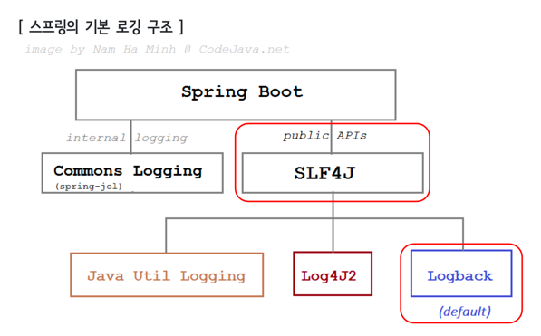

# Logging
> 소프트웨어가 실행되는 동안 일어나는 이벤트를 기록하는 과정

## 특징
로깅은 시스템 동작 상태의 모니터링, 오류 발생 시 원인 분석, 성능 최적화 등 다양한 상황에서 중요한 역할을 합니다.<br>
따라서 로깅 설정은 애플리케이션 개발과 운영에 있어서 중요한 부분입니다.<br>

## 스프링에서 로그 찍는법
스프링에서는 로깅 프레임워크를 사용하여 로그를 생성하고 관리합니다.<br> 
대표적인 로깅 프레임워크로는 Logback, Log4j, SLF4J 등이 있습니다.<br>
로깅 프레임워크를 사용하면 로그를 상세하게 찍을 수 있습니다.(로그 메시지의 출력 방식, 저장 위치, 포맷, 로그 레벨 등)<br>



스프링에서는 slf4j 라는 인터페이스를 상속받은 구현체 중 기본적으로 logback 을 기본 로깅 프레임워크로 사용합니다.<br>
스프링 부트에 기본으로 설정 되어 있어 별도의 라이브러리를 추가하지 않아도 됩니다.<br>
(spring-boot-starter-web 안에 spring-boot-starter-logging 에 구현체가 있다.)<br>

## 사용법
설정 파일(application.properties 또는 application.yml)을 통해 로그 레벨이나 출력 형식 등을 손쉽게 설정할 수 있습니다.
1. resources 경로 아래에 logback-spring.xml 을 만듭니다.
2. 원하는 로그 출력방식에 따라(db에 저장, 파일에 저장, 콘솔로 출력) 파일을 설정합니다.


## 로그 레벨
스프링에서는 다음과 같은 로그레벨이 있습니다.
> TRACE < DEBUG < INFO < WARN < ERROR

1) ERROR : 요청을 처리하는 중 오류가 발생한 경우 표시한다.
2) WARN :처리 가능한 문제, 향후 시스템 에러의 원인이 될 수 있는 경고성 메시지를 나타낸다. 
3) INFO : 상태변경과 같은 정보성 로그를 표시한다.
4) DEBUG : 프로그램을 디버깅하기 위한 정보를 표시한다.
5) TRACE : Debug 보다 훨씬 상세한 정보를 표시한다. (처리 흐름을 추적하기 위한)

기본적으로 스프링의 로그 출력레벨은 Info 입니다.<br>
하지만 개발 중에 더 세부적인 로그를 보려면 로그 레벨을 DEBUG 나 TRACE 로 설정할 수 있습니다.<br>
반대로 운영 환경에서는 로그의 양을 줄이기 위해 WARN 또는 ERROR로 설정할 수도 있습니다.<br>

### 예시
```java
logging.level.root=WARN
logging.level.org.springframework.web=DEBUG
logging.level.com.mycompany.myapp=INFO
```
개별적으로 로깅 레벨을 적용할 수 있습니다.


### xml 이 너무 싫은데 application.properties 만 이용해서 로깅 설정을 할 수 있나?
못합니다.
application.properties에서는 기본적으로 로그 레벨을 설정하는 것이 가능하지만, Logback이나 Log4j 같은 로깅 프레임워크의 세부적인 기능을 사용하려면 별도의 설정 파일(xml, yml 등)이 필요합니다.<br> 
이는 스프링 부트가 로깅 프레임워크의 기능을 모두 대체하는 것이 아니라, 기본적인 로그 설정을 더 쉽게 할 수 있도록 돕는 역할을 하기 때문입니다.<br>
예를 들어, 로그 메시지의 패턴 변경, 로그 파일의 위치 변경, 로그 파일의 롤링 정책 설정 등의 세부적인 설정은 Logback의 logback-spring.xml이나 Log4j의 log4j2-spring.xml 등의 설정 파일에서 직접 지정해야 합니다.<br>
따라서 application.properties와 로깅 프레임워크의 설정 파일은 각각의 목적에 맞게 적절히 사용하는 것이 좋습니다.<br> 
빠르고 간단하게 로그 레벨만 조정하려면 application.properties를 사용하고, 좀 더 복잡한 로깅 설정이 필요하면 로깅 프레임워크의 설정 파일을 사용해야합니다.<br>

**정리**: 스프링에서는 로깅에 대한 아주 기본적인 설정만 지원하며 복잡한 로그 관리 기능(예: 로그 파일 롤링, 로그 파일 사이즈 제한 등)이나 로그를 데이터베이스에 저장하는 기능을 사용하려면 별도의 로깅 프레임워크(Logback, Log4j 등)의 설정 파일이 필요합니다.<br>
따라서, 로깅에 대한 세부적인 요구사항이 있다면 logback-spring.xml 등의 설정 파일을 작성하여 로깅 프레임워크를 활용하는 것이 좋습니다.<br>


## 스프링은 왜 로깅 정책에 default 로 logback 을 사용하는가
Logback은 스프링 부트의 기본 로깅 프레임워크로 선택되었는데, 이는 Logback이 가진 다양한 장점 때문입니다:

1. 성능: Logback은 이전 버전의 로깅 프레임워크인 log4j에 비해 성능이 향상되었습니다.
2. 설정의 유연성: Logback 설정은 XML 또는 Groovy를 통해 이루어질 수 있으며, 설정 파일을 수정한 후에도 애플리케이션 재시작 없이 로깅 설정을 변경할 수 있습니다.
3. 다양한 로깅 정책 지원: Logback은 파일 크기 기반이나 일자별 로그 파일 롤링과 같은 다양한 로깅 정책을 지원합니다.
4. SLF4J 통합: Logback은 SLF4J(Simple Logging Facade for Java)와 직접 통합되어 있습니다. SLF4J는 자바의 로깅 퍼사드(Facade)로, 여러 로깅 프레임워크 사이를 자유롭게 전환할 수 있게 해줍니다. Logback을 사용하면 SLF4J API를 통해 로깅을 캡슐화할 수 있으며, 필요한 경우 다른 로깅 프레임워크로 쉽게 전환할 수 있습니다.
따라서 이러한 장점들로 인해 스프링 부트는 기본 로깅 프레임워크로 Logback을 선택하였습니다.