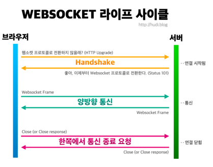

# 스프링 스케줄링
> 어플리케이션에서 주기적으로 또는 지정된 시간에 특정 작업을 실행하도록 설정하는데 사용됩니다.

## 스케줄링 기본설정
1. build.gradle 의 dependencies 블록에 스케쥴링 관련 API 에 대한 의존성 정보를 추가한다.
2. 메인 클래스에 @EnableScheduling 을 추가한다.

## 사용법
스프링 스케줄링은 주로 @Scheduled 애노테이션과 함께 사용됩니다.<br>
이 애노테이션을 사용하면 메서드 위에 지정하여 해당 메서드가 스케줄링된 작업을 수행하게 할 수 있습니다.<br>
예를 들어, 다음과 같이 @Scheduled 애노테이션을 사용할 수 있습니다<br>
```java
@Scheduled(fixedRate = 5000)
public void performTask() {
    // Task implementation
}
```
위 코드에서 fixedRate = 5000은 performTask 메서드가 매 5초마다 실행되도록 설정합니다.

cron을 이용하면 특정 시점를 지정해서 스케줄링을 할 수 있습니다.
```java
@Scheduled(cron = "0 * * * * ?")
public void runEveryMinute() {
    System.out.println("Execution Time - Every minute: " + LocalDateTime.now());
}
```
위의 예제에서, runEveryMinute 메서드는 매 분마다 실행됩니다. cron 표현식 "0 * * * * ?"은 매 분의 시작 시점에 매치됩니다.

스케줄링을 활성화하려면, 설정 클래스에 @EnableScheduling 애노테이션을 추가해야 합니다
```java
@Configuration
@EnableScheduling
public class AppConfig {
    //...
}
```

## 새해 기념 쿠폰 발급을 하는 생일인 사람에게 생일 쿠폰을 주는 스케줄링을 실행할 때 며칠전에 쿠폰 발급 메서드를 실행하면 해당 스케줄을 실행하는 메서드는 새해가 될 때 까지 쓰레드를 물고 있는건가?
예를 들어, 새해 기념 쿠폰 발급 로직이 있고 이를 실행하는 스케줄링 메서드가 새해가 될 때까지 실행되도록 설정되어 있다면, 이 메서드는 새해가 될 때까지 별도의 쓰레드에서 대기 상태에 있습니다. 
이 기간 동안 다른 요청을 처리하는 메인 애플리케이션 쓰레드는 이 스케줄링된 작업에 영향을 받지 않습니다.

## 쓰레드 풀의 크기가 200개라 할 때 스케줄 작업을 1년 뒤에 100개가 실행되게 하면 1년 동안은 쓰레드 100개 만으로 웹사이트를 운영해야하나?
스프링의 @Scheduled 애너테이션이 사용하는 스케줄러는 별도의 쓰레드 풀을 사용합니다. 
이 쓰레드 풀은 웹 애플리케이션의 주요 작업을 처리하는 쓰레드 풀과는 다릅니다. 
따라서 @Scheduled로 스케줄링된 작업이 많아도, 이는 웹 애플리케이션의 성능에 큰 영향을 미치지 않습니다.

그러나 만약 @Scheduled로 스케줄링된 작업이 너무 많아져서 스케줄링 쓰레드 풀의 쓰레드가 모두 사용되고 있다면, 새로운 스케줄링 작업이 추가될 때까지 기다려야 합니다.

따라서 스케줄 작업을 많이 등록하더라도, 그 작업들이 실행되는 시점까지는 별도의 쓰레드 풀에서 대기하므로, 웹 애플리케이션 쓰레드 풀의 쓰레드에는 영향을 미치지 않습니다.

그러나 스케줄링 작업이 너무 많아서 스케줄링 쓰레드 풀의 쓰레드가 모두 사용된다면, 새로운 스케줄링 작업을 등록할 수 없게 됩니다. 
이런 경우에는 쓰레드 풀의 크기를 적절히 조정하거나, 스케줄링 작업의 수를 줄여야 합니다.

참고로 스케줄링 쓰레드 풀의 크기는 기본적으로 1 이며 스케줄링에 여러 쓰레드를 사용하려한다면 ThreadPoolTaskScheduler의 poolSize 속성을 설정하여 쓰레드 풀의 크기를 늘릴 수 있습니다.
예를 들면 다음과 같이 설정할 수 있습니다.
```java
@Configuration
@EnableScheduling
public class SchedulerConfig implements SchedulingConfigurer {

    @Override
    public void configureTasks(ScheduledTaskRegistrar taskRegistrar) {
        ThreadPoolTaskScheduler taskScheduler = new ThreadPoolTaskScheduler();
        taskScheduler.setPoolSize(10);  // 쓰레드 풀 크기를 10으로 설정
        taskScheduler.initialize();
        taskRegistrar.setTaskScheduler(taskScheduler);
    }
}
```

## @EnableScheduling 을 붙혀야만 스케줄링이 된다. 왜 기본적으로 지원이 안되는가? 비용이 많이 드나?
위의 내용을 정리하면서 스케줄링 쓰레드가 따로 있는지 알았고 @EnableScheduling 을 하면 필요에 따라 스케줄링 전용 쓰레드 풀이 생성된다는 것을 알게되었습니다.<br>
그렇다면 @EnableScheduling 을 붙히면 스케줄링 전용 쓰레드가 생성되어 비용이 들기 때문에 기본적으로 지원하지 않는것인가 했는데 아니었습니다.<br>
@EnableScheduling 애너테이션은 스케줄링 기능을 활성화하는 것으로, 이 애너테이션을 설정하면 Spring은 스케줄링을 위한 TaskScheduler 인스턴스를 생성합니다.<br> 
그러나 실제 스케줄링 작업을 위한 쓰레드는 @Scheduled 애너테이션을 가진 메서드가 실제로 호출될 때 생성됩니다.<br>
따라서 @EnableScheduling을 붙였지만 @Scheduled 애너테이션을 가진 메서드가 없다면, 스케줄링을 위한 쓰레드는 생성되지 않습니다.<br> 
결국 실제로 스케줄링 작업을 수행하는 @Scheduled 애너테이션이 붙은 메서드가 있을 때 해당 작업을 수행하기 위한 쓰레드가 생성됩니다.<br>

## 스프링의 철칙
Spring은 "규모에 따라 적용"이라는 철학을 가지고 있습니다.<br>
이는 Spring이 가능한 가볍게 시작하고, 필요에 따라 추가 기능을 활성화하도록 설계되었음을 의미합니다.<br> 
따라서 모든 기능이 기본적으로 활성화되어 있다면, 그것들이 모두 메모리를 차지하고, 또한 그것들을 관리하기 위한 추가적인 리소스가 필요하게 됩니다.<br>
스케줄링 기능의 경우, 이것은 백그라운드에서 주기적으로 실행되는 작업을 관리하므로, 이러한 작업이 필요하지 않은 애플리케이션에서는 이 기능이 활성화되어 있으면 불필요한 오버헤드가 발생하게 됩니다.<br>
그래서 스프링은 기본적으로 이 기능을 비활성화하고, 필요한 애플리케이션에서만 명시적으로 활성화하도록 하고 있습니다.<br>


# 필터와 인터셉터 
필터와 인터셉터에 대한 내용은 저번에 살짝 다뤘을 떄 정리 해놨기 때문에 보충 설명만 적겠습니다.

## 필터와 인터셉터가 쓰이는 경우

1. 필터(Filter):
필터는 서블릿 컨테이너 레벨에서 동작합니다. 따라서, DispatcherServlet이 처리하기 전의 요청과 응답을 가로챌 수 있습니다.<br>
인코딩 설정, CORS(Cross-Origin Resource Sharing) 처리, 요청/응답 로깅 등의 기능을 수행합니다.<br>
필터는 스프링 컨텍스트 외부에서 동작하므로 스프링의 빈을 직접 사용할 수 없습니다(예외적으로 DelegatingFilterProxy를 사용하면 가능합니다).<br>
2. 인터셉터(Interceptor):
인터셉터는 스프링의 DispatcherServlet이 컨트롤러를 호출하기 전후로 요청을 가로챌 수 있습니다.<br>
인터셉터는 스프링 컨텍스트 내부에서 동작하므로 스프링의 빈을 사용할 수 있습니다.<br>
인증, 권한 확인, 요청 처리 시간 계산 등의 기능을 수행합니다.<br>
특정 패턴의 URL에 대해서만 작동하도록 설정할 수 있습니다.

## 필터는 왜 빈으로 등록되는가? 안되도 상관없지않나?
필터는 스프링 외부에서 동작하는데 왜 bean 으로 등록되어야 하는지에 대해 의문이 많았습니다.<br>
어차피 DS 로 가기전에 요청에 대한 처리를 하는 것 뿐인데 굳이 bean 으로 등록되어야하나? 라는 생각이 들었습니다.<br>
하지만 필터 또한 스프링의 기능을 사용하기 위해선 bean으로 등록되어야합니다.<br>
필터를 스프링 빈으로 등록하는 주요한 이유는 다음과 같습니다<br>

1. 의존성 주입: 스프링은 빈으로 등록된 객체에 대해 의존성 주입(Dependency Injection)을 지원합니다. 필터가 다른 스프링 빈(예: 서비스, 레포지토리 등)에 의존하는 경우, 이러한 의존성을 자동으로 관리해주기 위해 필터를 빈으로 등록할 필요가 있습니다.
2. 생명주기 관리: 스프링은 빈의 생명주기를 관리합니다. 빈으로 등록되면 스프링이 해당 객체의 생성과 소멸을 관리하며, 필요에 따라 빈의 스코프를 지정하여 사용할 수 있습니다.
3. 설정과 통합: 스프링 설정을 통해 필터의 순서나 활성화 조건 등을 편리하게 관리할 수 있습니다. 또한, 스프링 시큐리티와 같은 스프링의 다른 기능과 통합하여 사용할 수 있습니다.
따라서, 필터를 빈으로 등록하면 스프링 프레임워크의 다양한 기능을 활용하여 필터를 효율적으로 관리할 수 있습니다.

# 웹 소켓
> HTTP 환경에서 클라이언트와 서버 사이에 하나의 TCP 연결을 통해 실시간으로 전이중 통신을 가능하게 하는 프로토콜
## 특징
실시간 알림, 실시간 채팅 등 실시간이라는 키워드가 들어가는 기능들을 위해서는 대부분 웹 소켓 기술이 필요하다.

## 웹 소켓 라이프 사이클


## 웹 소켓 서버 구(Spring Boot WebSocket)
스프링(Spring)은 웹소켓(WebSocket)을 지원하는 기능을 제공하며, 스프링 웹소켓 서버를 구현하는 과정은 다음과 같습니다:

1. 의존성 추가: 스프링 웹소켓을 사용하기 위해 프로젝트의 의존성에 spring-boot-starter-websocket을 추가해야 합니다. 이를 위해 Maven 또는 Gradle을 사용할 수 있습니다.
2. WebSocket 구성: 스프링에서 웹소켓을 사용하려면 WebSocket 구성이 필요합니다. 구성은 @EnableWebSocket 어노테이션을 사용하여 활성화될 수 있습니다. 일반적으로 구성 클래스에 @Configuration 어노테이션을 추가하여 구성을 정의합니다.
3. WebSocketHandler 구현: WebSocketHandler 인터페이스를 구현하여 웹소켓 요청을 처리할 핸들러를 작성해야 합니다. 이 핸들러는 클라이언트와의 연결, 메시지 수신 및 전송 등의 작업을 처리합니다.
4. WebSocketHandlerRegistry 등록: WebSocketHandlerRegistry를 사용하여 WebSocketHandler를 등록해야 합니다. 등록된 핸들러는 클라이언트의 웹소켓 요청과 관련된 URL에 대해 호출됩니다. 등록은 registerHandler() 메서드를 사용하여 수행할 수 있습니다.
5. 웹소켓 엔드포인트 설정: 웹소켓 요청을 처리할 엔드포인트를 설정해야 합니다. 스프링에서는 WebSocketConfigurer 인터페이스를 구현하여 엔드포인트를 설정할 수 있습니다. 이를 통해 WebSocket의 엔드포인트 URL과 WebSocketHandler를 매핑합니다.
6. 웹소켓 클라이언트와의 통신: 클라이언트와의 웹소켓 통신을 위해 필요한 작업을 수행해야 합니다. 이는 주로 JavaScript를 사용하여 클라이언트 측에서 처리됩니다. 클라이언트는 웹소켓을 사용하여 서버와 연결하고, 메시지를 주고받을 수 있습니다.

## 스프링의 예외 처리
스프링에서는 컨트롤러에서 발생하는 예외를 @ControllerAdvice 를 사용해서 처리할 수 있는데
@ControllerAdvice는 스프링 프레임워크에서 예외 처리를 일괄적으로 처리하기 위해 사용되는 어노테이션입니다.
@ControllerAdvice를 사용하면 여러 컨트롤러에서 발생하는 예외를 한 곳에서 처리할 수 있으며, 공통된 예외 처리 로직을 중복 없이 구현할 수 있습니다.

## @ControllerAdvice와 @ExceptionHandler를 이용하여 예외를 처리하는 방법

1. @ControllerAdvice 어노테이션을 사용하여 예외 처리 클래스를 작성합니다. 일반적으로 클래스에 @ControllerAdvice 어노테이션을 추가하여 해당 클래스가 예외 처리를 담당하는 클래스임을 나타냅니다.
2. @ExceptionHandler 어노테이션을 사용하여 특정 예외에 대한 처리 메서드를 작성합니다. 예외 처리 메서드는 @ExceptionHandler 어노테이션과 함께 특정 예외 타입을 매개변수로 받아와 해당 예외를 처리하는 로직을 구현합니다.
3. 예외 처리 메서드 내에서 필요한 예외 처리 로직을 구현합니다. 예를 들어, 예외 정보를 로깅하거나 사용자에게 오류 메시지를 반환하는 등의 작업을 수행할 수 있습니다.
4. @ControllerAdvice 클래스에 @ExceptionHandler를 사용하여 정의한 예외 처리 메서드를 추가합니다. 이렇게 함으로써 해당 예외 타입이 발생했을 때 예외 처리 메서드가 실행되어 예외를 처리합니다.

## 예시
```java
@ControllerAdvice
public class GlobalExceptionHandler {

    @ExceptionHandler(Exception.class)
    public ResponseEntity<String> handleException(Exception ex) {
        // 예외 처리 로직
        return ResponseEntity.status(HttpStatus.INTERNAL_SERVER_ERROR).body("Internal Server Error");
    }

    @ExceptionHandler(UserNotFoundException.class)
    public ResponseEntity<String> handleUserNotFoundException(UserNotFoundException ex) {
        // 예외 처리 로직
        return ResponseEntity.status(HttpStatus.NOT_FOUND).body("User Not Found");
    }

    // 추가적인 예외 처리 메서드 작성 가능
}


@RestController
public class UserController {

    @GetMapping("/users/{id}")
    public ResponseEntity<String> getUser(@PathVariable("id") Long id) {
        // 예외 발생 예시
        throw new UserNotFoundException("User not found");
    }
}

```
