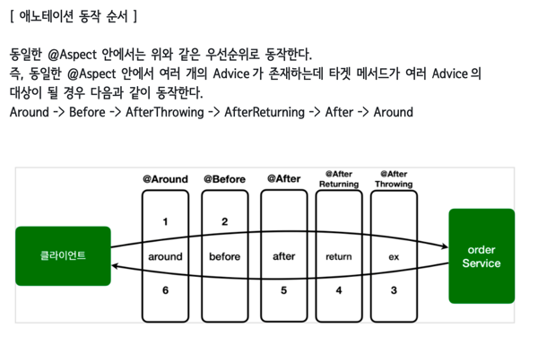

# AspectJ 와 Spring의 AOP 
> 코드 내의 핵심로직과 부가적인 로직을 구분하여 분리하는기술

## 장점

AspectJ의 장점
1. 강력한 기능: AspectJ는 다양한 AOP 기능을 제공하며, 메서드 실행 전후, 예외 처리, 필드 접근 등 다양한 지점(Pointcut)에 대한 어드바이스(Advice)를 지정할 수 있습니다. 또한, 포인트컷 표현식을 사용하여 세밀한 지정이 가능합니다.
2. 정적(컴파일 타임) 바이트코드 조작: AspectJ는 컴파일 단계에서 바이트코드를 조작하여 AOP를 적용합니다. 이로 인해 런타임 오버헤드가 적고, AOP의 성능이 뛰어납니다. 또한, 어노테이션 기반의 AOP보다 더 세밀한 포인트컷 지정이 가능합니다.

## AspectJ 와 Spring AOP 중 뭘 써야하나
AspectJ와 Spring AOP는 성능 면에서 다소 차이가 있습니다.  
AspectJ의 컴파일 타임 바이트 코드 조작은 AOP를 구현하기 위해 바이트 코드에 직접 변경을 가하는 것이기 때문에, 런타임 오버헤드가 매우 적습니다. AspectJ는 컴파일 시점에 이미 모든 AOP 관련 작업을 처리하므로, 런타임에는 추가적인 프록시 객체 생성 등이 필요하지 않습니다.  
따라서 AspectJ는 매우 빠른 성능을 제공할 수 있습니다. 
반면에 Spring AOP는 프록시 패턴을 기반으로 동작하고, 런타임에 프록시 객체를 생성하여 AOP를 적용합니다. 이는 런타임에 프록시 객체를 생성하고, 메서드 호출 시 프록시 객체를 경유하므로 약간의 오버헤드가 발생할 수 있습니다.  
또한, Spring AOP는 런타임에 프록시 객체를 동적으로 생성하기 때문에, AspectJ에 비해 성능면에서는 다소 느릴 수 있습니다. 

그러나 실제로 성능 차이가 미미하고, 대부분의 경우 Spring AOP의 오버헤드는 무시할 정도로 작습니다.  
Spring AOP는 스프링 프레임워크와의 통합이 용이하며, 프록시 기반으로 동작하기 때문에 일반적인 상황에서 충분한 성능을 제공합니다. 
AspectJ는 보다 고급 AOP 기능이 필요한 경우에 사용될 수 있습니다. 
성능은 상황에 따라 다를 수 있으며, 프로젝트의 요구사항과 환경에 따라 적절한 AOP 방식을 선택해야 합니다. 

결론은 대부분의 경우, Spring AOP를 사용하여 AOP를 구현하는 것이 간편하고 편리합니다.  
코드의 간결성과 개발자의 생산성을 고려한다면 Spring AOP를 선택하는 것이 좋습니다. 

## AOP 용어

1. Join point (조인 포인트): 프로그램 실행 중에 특정 시점에 실행되는 모든 지점을 가리킵니다. 메서드 호출, 필드 접근, 예외 발생 등이 조인 포인트에 해당할 수 있습니다.
2. Pointcut (포인트컷): AOP에서 조인 포인트의 부분 집합을 선택하는 데 사용되는 표현식 또는 규칙입니다. 포인트컷은 어떤 조인 포인트를 AOP 어드바이스가 적용될 대상으로 지정할지 결정합니다.
3. Advice (어드바이스): 포인트컷에서 선택된 조인 포인트에 적용되는 동작을 정의하는 것입니다. 어드바이스는 조인 포인트 앞, 뒤, 예외 발생 시점 등에서 실행될 수 있으며, 주요 어드바이스 유형으로는 before (메서드 실행 전), after (메서드 실행 후), around (메서드 실행 전후) 등이 있습니다.
4. Aspect (애스펙트): AOP에서 공통 관심사(Cross-cutting Concern)를 구현한 모듈을 의미합니다. 애스펙트는 포인트컷과 어드바이스를 조합하여 어떤 조인 포인트에 어떤 동작을 적용할지 정의합니다.
5. Weaving (위빙): AOP에서 애스펙트를 핵심 로직에 적용하는 과정을 말합니다. 위빙은 컴파일 타임, 로드 타임, 런타임 중 하나에서 발생할 수 있으며, 애스펙트의 코드가 핵심 로직에 주입되어 실행되도록 합니다.
6. Proxy (프록시): AOP에서 타깃 객체를 감싸는 래퍼 객체입니다. 프록시는 타깃 객체의 메서드 호출을 가로채고, 어드바이스 등을 실행할 수 있습니다. Spring AOP에서는 프록시 기반의 AOP를 사용하여 AOP를 구현합니다.

## Advice 의 종류
1. Before Advice (전처리 어드바이스): 조인 포인트가 실행되기 전에 실행되는 Advice입니다. 일반적으로 메서드 실행 전에 어떤 동작을 수행하기 위해 사용됩니다. 주로 입력값의 유효성 검사, 로깅, 보안 검사 등을 수행합니다.
2. After Returning Advice (후처리 어드바이스): 조인 포인트가 정상적으로 실행된 후에 실행되는 Advice입니다. 주로 메서드 실행 후에 반환값을 가공하거나 추가 동작을 수행하기 위해 사용됩니다.
3. After Throwing Advice (예외 처리 어드바이스): 조인 포인트에서 예외가 발생한 후에 실행되는 Advice입니다. 예외를 처리하고, 예외에 대한 추가적인 동작을 수행할 수 있습니다.
4. After Advice (무조건 실행 어드바이스): 조인 포인트가 실행된 후에 항상 실행되는 Advice입니다. 예외 발생 여부에 관계없이 항상 실행되며, 메서드의 정상 종료 또는 예외 발생 시에 모두 적용됩니다.
5. Around Advice (전체적인 제어 어드바이스): 조인 포인트를 전체적으로 제어하는 Advice입니다. 조인 포인트 앞뒤에서 실행되며, 원래의 동작을 중단하거나 변경할 수 있습니다. Around Advice는 가장 강력한 유형의 Advice로, 전체적인 제어가 필요한 경우 사용됩니다.

## PointCut의 종류
1. Execution Pointcut (메서드 실행 포인트컷): 특정 메서드의 실행 시점을 선택합니다. 메서드 이름, 인자 타입, 패키지, 클래스 등을 기준으로 메서드를 선택할 수 있습니다. 예를 들어, "execution(public void com.example.service.Service.(..))"는 "com.example.service" 패키지 내의 모든 "Service"로 끝나는 클래스의 메서드 실행을 선택합니다.
2. Within Pointcut (클래스 내부 포인트컷): 특정 클래스 내의 모든 메서드를 선택합니다. 클래스의 패키지, 이름 등을 기준으로 클래스를 선택할 수 있습니다. 예를 들어, "within(com.example.service..*)"는 "com.example.service" 패키지와 하위 패키지에 속하는 모든 클래스 내의 메서드를 선택합니다.
3. Bean Pointcut (빈 객체 포인트컷): 특정 빈 객체의 메서드를 선택합니다. 빈 객체의 이름, 타입, 어노테이션 등을 기준으로 빈 객체를 선택할 수 있습니다. 예를 들어, "bean(myService)"는 이름이 "myService"인 빈 객체의 메서드를 선택합니다.
4. Annotation Pointcut (어노테이션 포인트컷): 특정 어노테이션이 적용된 메서드를 선택합니다. 어노테이션 타입을 기준으로 메서드를 선택할 수 있으며, 해당 어노테이션이 메서드에 적용되어 있는 경우에만 선택됩니다. 예를 들어, "@Transactional" 어노테이션이 적용된 메서드를 선택합니다.
5. Custom Pointcut (사용자 정의 포인트컷): 사용자가 직접 정의한 포인트컷입니다. 사용자가 특정 패턴 또는 조건에 따라 메서드를 선택할 수 있습니다. 예를 들어, "execution(* com.example.service.(..)) && !execution( com.example.service.internal.*(..))"는 "com.example.service" 패키지의 메서드 중 "com.example.service.internal" 패키지 내의 메서드를 제외한 모든 메서드를 선택합니다.

## aop 애노테이션 동작 순서

## aop 의 프록시 
aop가 적용되는 코드가 실행되는 시점에 스프링 AOP 는 자동 프록시 생성기를 사용하여 프록시 객체를 자동으로 생성합니다. 
또한 프록시 객체가 생성될 때 실행되는 코드에 대한 aop 코드에 따라 바이트 코드 조작을 통해 맞춤형으로 프록시 객체를 생성합니다. 
주의* 스프링 어플리케이션이 실행될 떄 모든 프록시 객체가 생성되는것이 아니고 실행되는 코드에 aop 가 적용될 경우 프록시 객체가 생성됩니다.   

