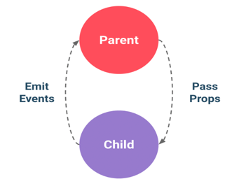

# csr,ssr 총정리 
장바구니에 물건 하나만 담아도 서버 갔다옴 -> ajax나옴 -> 필요한 정보만 가져옴 

# axios


## script setUp
SFC(Single-File Components) 내에서 Composition API를 사용하기 위한 컴파일 타임 구문
변수 선언, 함수 정의,import 처리 등 모두 템플릿 영역에서 사용되도록 자동 바인딩 된다.
예시:
```html
<script setup>
// 컴파일 될 때 Setup() 함수에 들어가는 내용이 된다..
</script>

<script setup>
  const msg = 'Hello!'
  function log() { console.log(msg)} 
</script>
<template>
  <button @click="log">{{ msg }}</button>
</template>


<script setup>
  import { capitalize } from './helpers'
</script>
<template>
  <div>{{ capitalize('hello') }}</div>
</template>

<script setup>
  import { ref } from 'vue'
  const count = ref(0)
</script>
<template>
  <button @click="count++">{{ count }} </button>
</template>

<!--import 된 컴포넌트도 컴포넌트 등록을 하지 않아도 템플릿에서 태그로 사용 가능하다.-->
<script setup>
  import MyComponent from './MyComponent.vue'
</script>
<template>
  <MyComponent />
</template>

<!--- defineProps() & defineEmits() 을 사용해서 부모 컴포넌트와 데이터를 송수신 할 수 있다.-->
<script setup>
  //부모 -> 자식(데이터 흐름)
  const props = defineProps({foo: String })
  //자식 -> 부모(데이터 흐름)
  const emit = defineEmits(['change', 'delete'])
  // setup code 
</script>
```

# toRefs()
반응성을 유지하면서 구조 분해 할당을 위한 메서드 
```html
<template>
  <div>
    <h3>Calculator3-외부 함수에 정의된 computed</h3>
    <div>
      <input type="text" v-model="num1" />
      <span> + </span>
      <input type="text" v-model="num2" />
      <span> = </span>
      <span>{{ result }}</span>
    </div>
  </div>
</template>
<script>
import { reactive, computed, toRefs } from 'vue' //toRefs 추가

function plusCalculator() {
  let state = reactive({
    num1: 0,
    num2: 0,
    result: computed(() => parseInt(state.num1) + parseInt(state.num2)),
  })
  return state;
}
export default {
  name: 'calculator',
  setup() {
    // 아무리 reactive 객체를 받아와도 구조분해 할당을 하면 반응성을 잃어버림
    // 반응성을 유지하면서 구조분해 할당하려면 toRefs()를 호출한 결과로 할당함
    let { num1, num2, result } = toRefs(plusCalculator()) //외부 function
    return {
      num1,
      num2,
      result,
    }
  },
}
</script>

const plusCalculator = () => {
let state = reactive({
num1: 0,
num2: 0,
result: computed(() => parseInt(state.num1) + parseInt(state.num2))
});

return toRefs(state);
};
```
# Vue 컴포넌트간 통신 방법

(1) props 
(2) emit
(3) v-model 
(4) refs
(5) provide/inject
(6) eventBus
(7) vuex/pinia


# 
????
common.js
axios
export import
교안 보고 정리
Vue 컴포넌트간 통신 방법 추가
????