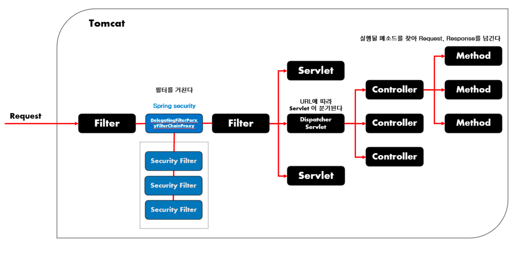

# provide, inject
provide: 부모 컴포넌트에서 자식 컴포넌트로 데이터를 전달할 수 있도록 제공하는 함수입니다.
inject: 자식 컴포넌트에서 부모 컴포넌트에서 제공된 데이터를 주입받는 함수입니다.
```html
<!-- ParentComponent.vue -->
<template>
  <div>
    <child-component></child-component>
  </div>
</template>

<script>
import { provide } from 'vue';

export default {
  setup() {
    provide('message', 'Hello, World!');
  }
}
</script>

<!-- ChildComponent.vue -->
<template>
  <div>
    <p>{{ injectedMessage }}</p>
  </div>
</template>

<script>
import { inject } from 'vue';

export default {
  setup() {
    const message = inject('message');
    return {
      injectedMessage: message
    };
  }
}
</script>

```

# VUEX
Vuex는 Vue.js 애플리케이션의 상태 관리 패턴과 라이브러리입니다.
Vuex는 중앙 집중식 저장소를 제공하여 애플리케이션의 모든 컴포넌트에서 공유되는 상태를 관리하고 업데이트하는 데 사용됩니다.

## Vuex의 핵심 개념
1. State: 애플리케이션의 상태 데이터를 저장하는 객체입니다. 여러 컴포넌트에서 공유되는 데이터를 저장하고 관리합니다.
2. Getters: 상태 데이터에 대한 계산된 속성을 제공하는 메소드입니다. Getters를 사용하여 필요한 데이터를 추출하거나 계산할 수 있습니다.
3. Mutations: 상태 데이터를 변경하는 메소드입니다. Mutations는 동기적으로 실행되어 상태를 업데이트하고, 추적 가능한 상태 변화를 제공합니다.
4. Actions: 비동기적인 작업이나 여러 Mutations의 연속적인 실행을 처리하는 메소드입니다. Actions를 사용하여 비동기 작업을 수행하고 Mutations를 호출하여 상태를 업데이트할 수 있습니다.
5. Modules: 큰 규모의 애플리케이션에서 Vuex 코드를 모듈로 구성할 수 있습니다. 각 모듈은 상태, getters, mutations, actions를 갖고 독립적으로 관리될 수 있습니다.


```js
import { createStore } from "vuex";

export default createStore({
  state: {
    counter: 10
  },
  getters: {
    time2(state) {
      return state.counter * 2;
    }
  },
  mutations: {
    setCounter(state, value) {
      state.counter = value;
    }
  },
  actions: {
    setLayzCounter(context) {
      setTimeout(() =>context.commit('setCounter', 1000), 5000)
    }
  }
  
});

```

````html
<template>
  <div>
    <h2>Vuex의 store 를 사용하여 출력하는 내용</h2>
    <h3>{{ counter }}</h3>
    <h3>getter 호출 : {{ test }}</h3>
    <button @click="inc">mutation 호출결과</button>
    <button @click="asyncinc">action 호출결과</button>
  </div>
</template>
<script>
  import { computed } from "vue";
  import { useStore } from "vuex";
  export default {
    setup() {
      const store = useStore();
      console.log(store)
      const counter = computed(() => store.state.counter);
      const test = computed(() => store.getters);
      const inc = () => store.commit("setCounter", counter.value + 1);
      const asyncinc = () => store.dispatch("setLayzCounter");

      return { counter, inc, test, asyncinc };
    }
  };
</script>
````

# Pinia
Pinia는 Vue.js용 스토어 라이브러리 및 상태 관리 프레임워크이다.

|종류|설명|
|---|---|
|Store| 전역 데이터가 저장되는 저장소|
|State|  전역 데이터|
|Getters| 저장소에서 데이터를 검색하는 방법|
|Actions| 저장소에서 데이터를 수정하는 방법|

````js
// stores/counter.js
import { defineStore } from 'pinia'

export const useCounterStore = defineStore('counter', {
  // 자동으로 반응성을 갖게됨
  state: () => {
    return { count: 0, name: '김정현' }
  },
  // could also be defined as
  // state: () => ({ count: 0 })
  getters: {
    getName: (state) => state.name+"!!",
  },
  actions: {
    increment() {
      this.count++
    },
  },
})

````

# watch, watchEffect
````html
<template>
    <h2>watch와 watchEffect 테스트</h2>
    <div>
        <h3>{{ num1 }}</h3>
        <button @click="num1++">increase num1</button>
        <h3>{{ num2 }}</h3>
        <button @click="num2++">increase num2</button>
    </div>
</template>

<script setup>
import { ref, watch, watchEffect } from 'vue';
const num1 = ref(10);
const num2 = ref(100);

// watch : num1 값의 변경이 감지되어야 실행이됨.
watch(num1, (after, previous) => {
    console.log(`[W]현재값 : ${after}`);
    console.log(`[W]이전값 : ${previous}`);
});
// 등록된 함수에서 다루는 반응형 변수의 값이 변경될 떄마다 실행
// 최초로 렌더링 될 때도 실행됨
// 감시 할 필요가 없어지면 중단시키는 기능이 있다.
watchEffect(() => {
    console.log("num1 이나 num2 가 변경됨!!!");
    console.log(`[WE]num1 : ${num1.value}`);
    console.log(`[WE]num2 : ${num2.value}`);
});        
</script>
````

# Spring Security
> Java 애플리케이션에 대한 인증, 권한 부여 및 기타 보안 기능을 제공하는 강력한 프레임워크입니다

## Authentication
> 특정 대상이 "누구"인지 확인하는 절차이다.

Spring Security는 사용자의 신원을 확인하기 위한 다양한 인증 메커니즘을 제공합니다.
사용자 이름/비밀번호 인증, 토큰 기반 인증, LDAP, OAuth 등을 지원합니다. 
또한 사용자 정의 인증 프로바이더를 지원합니다.

## authorization
> 인증된 주체가 특정한 곳에 접근 권한을 확인하고 허용하는 과정이다.

Spring Security는 사용자에게 특정 작업 또는 자원에 대한 권한을 부여하는 기능을 제공합니다.
권한은 역할(Role) 또는 권한(Permission)의 개념으로 정의되며, 애플리케이션에서 사용자의 역할과 권한을 관리할 수 있습니다.

## Spring security 에서 가장 중요한 것은 Filter다.

Spring Security는 다양한 필터(Filter)를 사용하여 보안 관련 작업을 수행합니다.
각각의 필터는 특정한 보안 기능을 담당하고 필터 체인을 통해 연결되어 작업을 처리합니다.
이러한 필터들은 HTTP 요청을 가로채고 처리하는 역할을 수행하며, 인증, 권한 부여, 세션 관리 등 다양한 보안 기능을 구현합니다.
### Spring Security 의 주요 Filter
1. UsernamePasswordAuthenticationFilter: 사용자 이름과 비밀번호를 기반으로 인증을 수행하는 필터입니다. 사용자가 로그인한 정보를 확인하고, 인증 처리를 진행합니다.
2. BasicAuthenticationFilter: Basic 인증을 처리하는 필터로, 사용자 이름과 비밀번호를 HTTP 요청의 헤더에 포함시켜 인증을 수행합니다.
3. RememberMeAuthenticationFilter: Remember Me 기능을 처리하는 필터로, 사용자의 로그인 정보를 기억하여 자동 로그인을 지원합니다.
4. AnonymousAuthenticationFilter: 인증되지 않은 사용자를 대체하기 위해 임의의 인증 객체를 생성하는 필터입니다. 사용자가 인증되지 않은 경우에도 익명 사용자로서 액세스를 허용할 수 있습니다.
5. AuthorizationFilter: 권한 부여를 처리하는 필터로, 사용자가 특정한 자원에 접근할 권한이 있는지 확인합니다.
6. SessionManagementFilter: 세션 관리를 처리하는 필터로, 동시 로그인 제한, 세션 타임아웃, 세션 생성 등의 작업을 수행합니다.

이 외에도 CSRF(Cross-Site Request Forgery) 방지 필터, 로그아웃 처리 필터, 인증 예외 처리 필터 등 다양한 필터가 제공됩니다. 
또한 개발자가 필요에 따라 커스텀 필터를 작성하여 Spring Security의 필터 체인에 추가할 수도 있습니다.
이를 통해 보다 세밀한 보안 요구 사항을 구현할 수 있습니다. 

## 적용방법
1. 의존성 추가
2. 설정파일 작성(Spring Security의 securityConfig 작성)

## 설정파일 작성 방법
1. WebSecurityConfigurerAdapter를 사용하는 방법
```java
@Configuration
@EnableWebSecurity
public class SecurityConfig extends WebSecurityConfigurerAdapter {
    
    @Override
    protected void configure(HttpSecurity http) throws Exception {
        http
            .authorizeRequests()
                .antMatchers("/public").permitAll()
                .anyRequest().authenticated()
                .and()
            .formLogin()
                .and()
            .logout();
    }
}
```
2. SecurityFilterChain를 Bean으로 등록하여 사용하는 방법
````java
@Configuration
@EnableWebSecurity
public class SecurityConfig {

    @Bean
    public SecurityFilterChain securityFilterChain(HttpSecurity http) throws Exception {
        http
            .authorizeRequests()
                .antMatchers("/public").permitAll()
                .anyRequest().authenticated()
                .and()
            .formLogin()
                .and()
            .logout();
            
        return http.build();
    }
}
````
1 은 deprecated 되었다.
2 의 장점은 무엇인가?
WebSecurityConfigurerAdapter의 주된 문제는 단일 WebSecurityConfigurer 구성만 허용한다는 점입니다. 
따라서 다중 보안 구성이 필요한 경우에는 확장성과 유연성이 제한되었습니다. 
이에 반해 SecurityFilterChain은 다중 필터 체인을 정의할 수 있도록 더욱 유연한 방식을 제공합니다.

### 다중 보안 구성이란?
다중 보안 구성이란, 하나 이상의 보안 설정을 동시에 적용해야 하는 경우를 의미합니다.
예를 들어, 애플리케이션의 다른 경로나 엔드포인트에 대해 서로 다른 보안 규칙이 적용되어야 할 수 있습니다.

WebSecurityConfigurerAdapter는 단일 보안 구성만 허용하기 때문에, 여러 경로나 엔드포인트에 대한 다른 보안 규칙을 적용하기가 어렵습니다.
예를 들어, 사용자 인증과 권한 부여가 필요한 경로와 공개적으로 접근 가능한 경로가 혼합된 경우, 각 경로에 대해 다른 보안 규칙을 적용하려면 다중 보안 구성이 필요합니다.

SecurityFilterChain을 사용하면 다중 보안 구성을 쉽게 구현할 수 있습니다.
각각의 SecurityFilterChain은 특정 경로 또는 엔드포인트에 대한 보안 필터 체인을 정의하므로, 각 경로마다 필요한 보안 규칙을 개별적으로 구성할 수 있습니다. 
이렇게 하면 다중 보안 구성을 효과적으로 처리할 수 있습니다.

## form login 과정

기본적인 formLogin 인증 API 구조

http.formLogin()
.login("/login") 
.defaultSuccessUrl("/home") 
.failureUrl("/login") 
.usernameParameter("username") 
.passwordParameter("password") 
.loginProcessingUrl("/login") 
.successHandler(loginSuccessHandler()) 
.failureHandler(loginFailureHander())


login : 사용자가 정의한 로그인 페이지
defaultSuccessUrl: 로그인 성공 후 이동하는 페이지 
failureUrl: 로그인 실패 후 이동하는 페이지 
usernameParameter: 폼 태그에 사용되는 아이디 파라미터명 
passwordParameter: 폼 태그에 사용되는 비밀번호 파라미터명 
loginProcessingUrl: 폼 태그에 사용되는 url
successHandler: 로그인 성공 후 실행되는 handler 
failureHandler: 로그인 실패 후 실행되는 handler

## form login 인증 절차
1. Http Request가 서버로 넘어온다.
2. AuthenticationFilter가 요청을 낚아챈다. AuthenticationFilter에서 Request의 Username, password를 이용하여 UsernamePasswordToken 을 생성한다. 
3. 토큰을 AuthenticationManager 가 받는다.
4. AuthenticationManager는 토큰을 AuthenticationProvider에게 토큰을 넘긴다.
5. AuthenticationProvider는 UserDetailsService로 토큰의 사용자 아이디(username)을 전달하여 DB에 존재하는지 확인한다.
6. UserDetailsService는 DB의 회원정보를 UserDetails 라는 객체로 반환한다.
7~10. AuthenticationProvider는 반환받은 UserDetails 객체와 실제 사용자의 입력정보를 비교한다. 
비교가 완료되면 사용자 정보를 가진 Authentication 객체를 SecurityContextHolder에 담은 이후 AuthenticationSuccessHandle를 실행한다.(실패시 AuthenticationFailureHandler를 실행한다.)

# JWT(Json Web Token)
> 웹 표준으로서, 클라이언트와 서버 간의 인증을 위해 사용되는 토큰 기반의 인증 방식입니다.

JWT는 JSON 형식으로 정보를 안전하게 전송하기 위해 사용되며, 주로 인증된 사용자를 식별하고 인가 작업을 수행하는 데 사용됩니다.

## JWT 가 나오게 된 과정
초기에는 쿠키와 세션을 이용하여 client-server 통신을 했습니다.<br>
하지만 쿠키 기반 인증은 몇 가지 제한 사항이 있습니다.<br>
가장 큰 제한 사항은 상태를 유지하기 위해 서버에 세션을 저장해야 한다는 것입니다.<br> 
이로 인해 서버에 대한 상태 관리의 부담이 커지고, 서버 확장성이 저하될 수 있습니다.<br> 
또한, 다중 서버 환경에서 세션 정보를 동기화하는 데 어려움이 있을 수 있습니다.<br>
<br>
이러한 제한 사항을 극복하기 위해 JWT가 등장하였습니다.<br>
JWT는 클라이언트와 서버 간의 인증을 위한 토큰 기반 방식으로, 서버에 세션을 유지할 필요 없이 클라이언트에게 토큰을 발급하고 이를 이용하여 인증을 처리합니다.<br>
이로써 서버의 상태 관리 부담을 줄이고 확장성을 향상시킬 수 있습니다.<br>
<br>
여기서 JWT 는 session 에 저장되던 내용을 쿠키형식으로 클라이언트 쪽에 제공하기 때문에 보안에 취약하다고 생각할 수 있습니다.<br>
하지만 JWT 는 페이로드(Payload)라는 부분에 사용자 정보를 포함시킵니다.<br> 
페이로드에는 사용자의 식별자, 권한 등 필요한 정보를 포함할 수 있습니다.<br>
이 토큰은 서명(Signature)을 통해 변조 방지와 무결성 검증을 수행합니다.<br>
<br>
클라이언트가 인증이 필요한 요청을 보낼 때, JWT를 포함시켜 서버에 전달합니다.<br>
서버는 이 JWT를 검증하여 유효한 토큰인지 확인하고, 토큰에 포함된 사용자 정보를 이용하여 인증 및 권한 검사를 수행합니다.<br> 
따라서 서버는 세션을 유지할 필요 없이 토큰만을 이용하여 사용자를 인증하고 정보를 확인할 수 있습니다.<br>
<br>
이렇게 JWT를 사용하여 사용자 정보를 저장하면 서버에서는 세션을 관리하지 않아도 되므로 상태 관리의 부담이 줄어들고 확장성이 향상됩니다.<br> 
또한, 클라이언트는 토큰을 이용하여 다양한 서버에 인증을 요청할 수 있으며, 분산 환경에서도 효과적으로 인증을 처리할 수 있습니다.<br>

따라서, 서버는 토큰의 유효성을 검사하고 토큰을 해독하여 내용을 얻어옴으로써 클라이언트의 인증 및 권한 검사를 수행합니다.

## JWT 의 구성
헤더(Header): 토큰의 유형 및 해싱 알고리즘 등의 메타데이터를 포함합니다.
페이로드(Payload): 클레임(claim) 정보가 포함되는 부분으로, 클라이언트와 서버 간에 전송되는 데이터를 담습니다. 클레임은 사용자의 ID, 권한 등과 같은 정보를 포함할 수 있습니다.
서명(Signature): 토큰의 무결성을 검증하기 위한 서명입니다. 헤더, 페이로드 및 시크릿 키를 사용하여 생성됩니다.

## JWT 를 이용한 인증 과정

## 


???
@Secured? p8
JWT 를 이용한 인증 과정
refreshToken
???