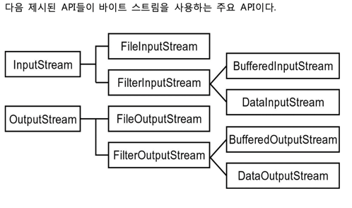
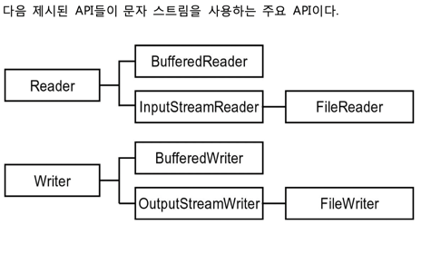

# Collections
> 컬렉션 API 들을 사용함에 있어서 여러 유용한 기능을 제공

# Comparable interface
compareTo 추상 메서드가 정의되어 있는 인터페이스다.

비교를 하기위해서는 Comparable 을 상속받고 compareTo 를 구현하면된다.

자바에서 Comparable 을 상속한 클래스를 타입으로 가진 리스트
```java
class Person implements Comparable<Person>{
       
}
List<Person> list = new ArrayList<>();
Collections.sort(list);
```
sort의 메서드는 다음과 같다.
```java
public static <T extends Comparable<? super T>> void sort(List<T> list){
    list.sort(null);
        }
```
**메서드 해석**

공용 정적 메소드를 선언합니다.
이 메소드는 하나의 매개변수를 가지며, 이 매개변수는 List<T> 타입입니다.
여기서 T는 Comparable 인터페이스를 구현한 클래스의 인스턴스입니다. 이렇게 하면 리스트에 있는 객체들끼리 비교할 수 있습니다.
list.sort(null); : sort 메소드 내부에서는 매개변수로 받은 list의 sort 메소드를 호출합니다. null을 전달함으로써 자동으로 자연 순서(기본 정렬 순서)에 따라 리스트를 정렬합니다.
결론적으로, 이 코드는 주어진 리스트를 자연 순서(기본 정렬 순서)에 따라 정렬하는 공용 정적 메소드를 정의한 것입니다. 
리스트에 있는 객체는 Comparable 인터페이스를 구현해야 합니다.

# equals
Object 클래스 의 equals 는 주소비교다.

주소비교를 하지않으려면 Object 클래스의 equals 를 오버라이드해서 사용하자
# hashCode
> 해시코드를 반환하는 메서드
```java
Objects.hash(productID);
```
Objects 클래스의 hash 메서드를 통해 원하는 값(들)의 해시코드를 반환받는다.
비교연산자에서 hash -> equals 순으로 비교??

# Java I/O 프로그래밍
> 데이터를 외부로 입력받거나 출력하는 등의 프로그래밍 기법

### java.io 패키지
> 입출력 기능의 API,파일 시스을 다룰 수 있는 API 를 가지고 있는 패키지

### 스트림 입출력
Java 는 플랫폼 독립적인 데이터 입출력 지원을 위해 스트림이라는 추상적인 구조를 이용한다.
스트림이란 순서가 있고 길이가 정해져 있지 않은 일련의 데이터 흐름을 의미하는 추상적인 개념으로서 프로그램과 입출력 장치 사이에서 입출력 자료들을 중계하는 역할을 담당한다.

### byte 스트림
> 바이트 스트림은 byte타입, byte타입 배열, 기본형 데이터 그리고 이진 파일 형식의 객체형 데이터의 입출력을 처리 할 수 있다. 1바이트 단위로 입출력을 처리한다.


### 문자 스트림
> 문자 스트림은 char 타입, char 타입 배열과 같은 문자형 데이터와 문자열 데이터의 입출력을 처리할 수 있다. 영 어 이외의 문자에 대한 처리와 문자 인코딩을 내부에서 처리하며 유니코드를 지원하는 Java 특성에 맞게 2바이 트 크기로 입출력을 수행한다.


 
### File 클래스
> File클래스는 파일 및 디렉터리를 관리할 수 있는 기능을 제공하는 클래스이다.

### 자원 해제처리
리소스(한정된 자원)는 사용하고 해제처리 해야 한다.

웹 개발에서 사용되는 리소스는 대표적으로 파일핸들,소켓,데이터베이스 연결(dbcp),스레드,메모리 버퍼등이 있다.

이러한 리소스들은 시스템이 한정된 수량만 사용할 수 있으므로, 사용 후에는 적절하게 해제하여 자원의 효율적인 사용을 보장해야 한다.

이를 위해 Java에서는 try-with-resources 문을 사용하여 리소스를 자동으로 관리할 수 있다.

### try-with-resource
> 리소스 자동관리 기능이며 주로 I/O 작업 및 데이터베이스 연결과 같이 리소스를 사용하는 작업에서 발생하는 예외 처리와 관련된 코드를 단순화하는 데 사용된다.

AutoClosable, Closable 인터페이스를 상속받은 객체들만 리소스 자동 해제가 가능하다
