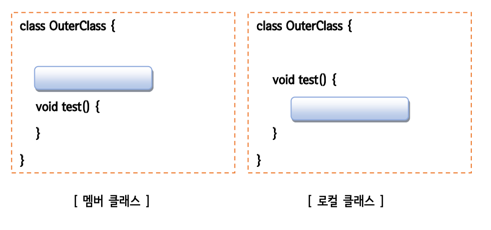
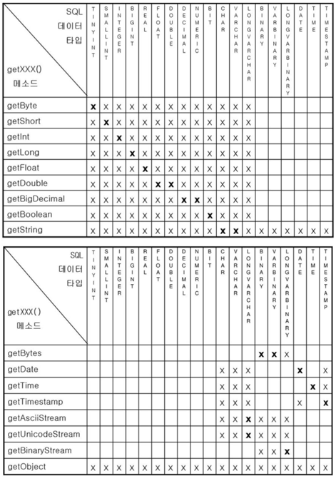

# Inner class(내부 클래스)
> 정의: 클래스 내부에 정의되는있는 클래스

## 장점
클래스 내부에 관련된 클래스를 정의(캡슐화)함으로써 코드의 복잡성을 줄일 수 있다.   

## 특징
내부 클래스어는 클래스 파일이 독립적으로 만들어진다.
## 내부 클래스의 종류
내부 클래스는 정의되는 위치에 따라 멤버 클래스와 로컬 클래스로 나뉜다.  
멤버 변수와 지역 변수로 나뉘는 변수와 같이 내부 클래스도 클래스의 멤버로 정의되는 멤버 클래스와 메서드 내에 정의되는 로컬 클래스로 나뉜다. 
각각 변수와 비슷한 유효범위와 성격을 지원한다.

멤버 클래스는 인스턴스 클래스와 스태틱 클래스로 구성되며 로컬 클래스는 이름이 있는 로컬 클래스와 이름이 없는 로컬 클래스(anonymous 클래스)로 나뉜다.

## 종류별 쓰는 법

### 1. 인스턴스 멤버 클래스(non-static member class)
인스턴스 클래스는 외부 클래스의 인스턴스 멤버처럼 다루어 지며 주로 외부 클래스의 인스턴스 멤버들과 관련된 작 업에 사용될 목적으로 정의된다.

### 2. static 멤버 클래스(static member class)
스태틱 클래스는 외부 클래스의 클래스 멤버(static 멤버)처럼 다루어 지며 주로 외부 클래스의 클래스 메서드내에서 사용될 목적으로 정의된다.

### 3. 로컬 클래스(local class)
로컬 클래스 내부에서 외부 클래스의 메서드의 지역변수를 쓸 수 있다.
외부 클래스의 메서드의 지역변수는 변경할 수 없다. 
final 을 명시적으로 붙혀주는게 좋다.
특징: 거의 안쓴다.

### 4. 익명 로컬 클래스(anonymous local class)
1회용 클래스
메서드 호출 시 매개변수의 타입이 추상 클래스 형이거나 인터페이스 형이어서 가볍게 구현(자손) 클래스를 만들고
객체를 생성해서 전달하려는 경우 유용하게 사용될 수 있는 구문

----
# JDBC 프로그래밍
> 정의: 자바에서 dbms 연결해서 

### 특징
JDBC 의 경우 대부분의 API 가 인터페이스이다. 
이유 -> db 서버와 무관하게 쿼리문을 사용하기 위해

# SQL 문법
DDL(Data Definition Language, 데이터 정의 언어) 
각 릴레이션을 정의하기 위해 사용하는 언어 (CREATE, ALTER, DROP...) 

DML(Data Manipulation Language, 데이터 조작 언어) 
데이터를 추가/수정/삭제하기 위한, 즉 데이터 관리를 위한 언어 (SELECT, INSERT, UPDATE...) 

DCL(Data Control Language, 데이터 제어 언어) 
사용자 관리 및 사용자별로 릴레이션 또는 데이터를 관리하고 접근하는 권한을 다루기 위한 언어 (GRANT, REVOKE...) 

### 사용법
1. Driver 로드
   DriverManager로 어떤 DB를 사용할 것인지 드라이버를 로드한다. Class.forName("com.mysql.cj.jdbc.Driver");
   각 DB마다 고유의 드라이버 이름이 있다.
2. Connection 얻기
   DB를 결정 후, 연결을 위해 연결 정보(DB 서버 url, ID, PW등)를 입력한다.
   String url = "jdbc:mysql://localhost:3306/sqldb?characterEncoding=UTF-8&serverTimezone=UTC"; String user = "root";
   String passwd = "1234";
   Connection conn = DriverManager.getConnection(url, user, passwd);
3. Statement 작성
   DB 서버에 SQL 명령을 전달하여 실행시키기 위한 객체를 생성한다. Statement stmt = conn.createStatement();
4. SELECT 명령을 실행하고 실행 결과를 ResultSet에 담기
   SELECT 명령을 실행한 결과는 JDBC 드라이버가 ResultSet이라는 객체로 반환한다. ResultSet rs = stmt.excuteQuery("SELECT ename, sal FROM emp");
5. ResultSet 객체에서 값 꺼내오기
   rs.next()
   String name = rs.getString("ename") int salary = rs.getInt("sal")
   select 된 객체가 없으면 비어있는 ResultSet 을 반환한다.
6. 커넥션 반환하기
   반환 작업은 사용했던 객체를 역순으로 닫는다.
   rs.close(); stmt.close(); conn.close();

## 주의점
select * 쓰지마라 -> 가독성
## java 타입별 적정 db 데이터 타입

