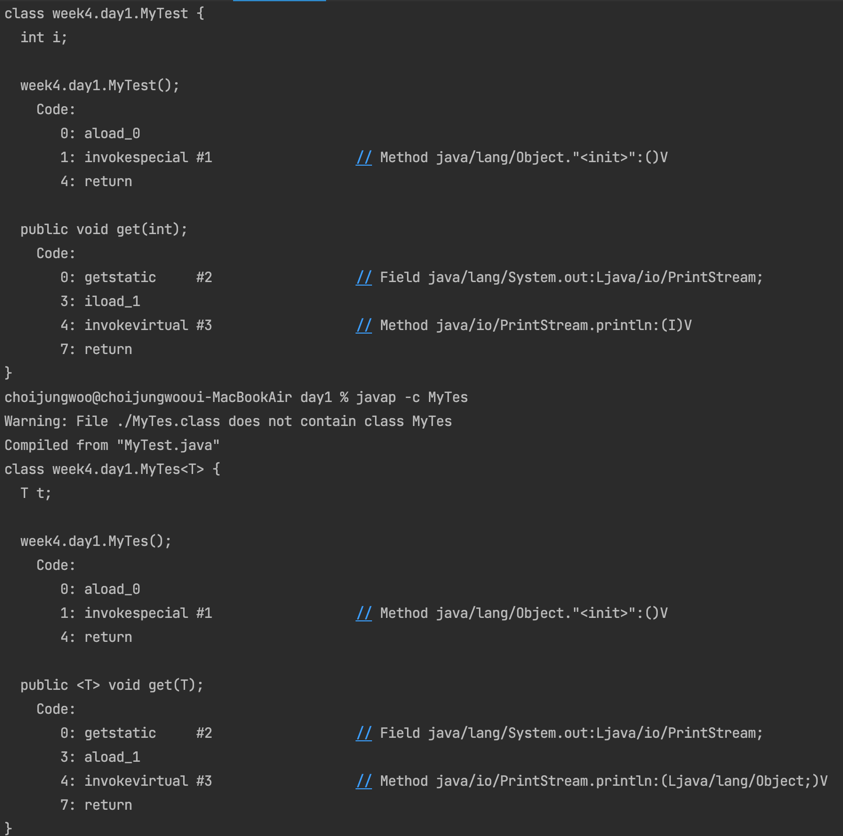

## DML (Data Manipulation Language)

DML (Data Manipulation Language)은 데이터베이스 관리 시스템(DBMS)에서 데이터를 조작하고 관리하는 데 사용되는 SQL의 하위 집합입니다. 
DML은 데이터베이스 내의 데이터에 대한 CRUD (Create, Read, Update, Delete) 작업을 수행하는 데 사용되는 명령어들로 구성되어 있습니다. 
주요 DML 명령어는 다음과 같습니다:

| DML 명령어 | 명령에 따른 동작            |
|---------|----------------------|
| SELECT  | 테이블에서 데이터를 조회하는데 사용됩니다. 필터, 정렬화, 그룹화 등 다양한 옵션을 사용하여 원하는 데이터를 추출할 수 있습니다.| 
| INSERT  | 테이블 새로운 데이터 행을 추가할 수 있습니다.|
| UPDATE  | 테이블의 기존 데이터를 수정하는데 사용됩니다.| 
| DELETE  | 테이블에서 행을 삭제하는데 사용됩니다.|

## DDL (Data Definition Language)
DDL (Data Definition Language)은 데이터베이스 관리 시스템(DBMS)에서 데이터베이스의 구조와 스키마를 정의, 변경, 제거하는 데 사용되는 SQL의 하위 집합입니다.
DDL은 테이블, 인덱스, 제약 조건 등 데이터베이스 개체를 생성, 수정 및 삭제하는 명령어로 구성되어 있습니다. 
주요 DDL 명령어는 다음과 같습니다:

| DDL 명령어  | 명령에 따른 동작  |
|----------|------------|
| CREATE   | 데이터베이스 개체(테이블, 인덱스, 뷰, 스토어드 프로시저 등)를 생성  | 
| ALTER    | 데이터베이스 개체를 변경하는 데 사용됩니다. 테이블 구조를 수정하거나, 인덱스를 추가, 삭제하거나, 제약 조건을 변경하는 등의 작업을 수행할 수 있습니다. |
| DROP     | 데이터베이스 개체를 삭제하는 데 사용됩니다. 테이블, 인덱스, 뷰, 스토어드 프로시저 등을 영구적으로 삭제합니다.        |
| TRUNCATE |테이블의 모든 데이터를 삭제하고, 저장된 공간을 해제하는 데 사용됩니다. DELETE와 달리 트랜잭션 로그를 기록하지 않고 데이터를 삭제하기 때문에 더 빠른 속도로 수행되지만, 복구가 불가능하므로 주의가 필요합니다.|

# 와일드카드 타입 파라미터
> 제네릭 타입을 매개값이나 리턴 타입으로 사용할 떄 범위에 있는 모든 타입으로 대체할 수 있는 타입 파라미터이다.

### 사용예시
```java
리턴타입 메서드명(제네릭 타입<? extends Student> 변수){}
// 매개변수의 타입이 Student나 그의 하위타입으로 제한한다. 
리턴타입 메서드명(제네릭 타입<? super Student> 변수){}
// 매개변수의 타입이 Student나 그의 상위타입으로 제한한다.
리턴타입 메서드명(제네릭 타입<?> 변수){}
// 매개변수의 타입을 모든 타입으로 제한한다.
```

### 제네릭 메서드
타입 파라미터를 가지고 있 메서드다.
타입 파라미터가 메서드 선언부에 정의된다.
리턴 타입 앞에 <> 기호와 타입 파라미터를 정의한 후 리턴 타입과 매개변수 타입에서 사용한다.

- 사용예시
```java
public class Test {
    public <T, F extends Student> T Box(T t, F f) {
           //매개변수의 타입을 선언    //리턴타입 선언 //매개변수를 정의하는 부분
        int i =0;
        T tType  = t;
        System.out.println(f.toString());
        return tType;
    }
}
```

### 제네릭 클래스도 선언할 수 있다.

- 사용예시
```java
class My<T> {
	T obj;
	My(T obj) {
		this.obj = obj;
	}
	public String toString() {
		return obj.getClass().getName()+"객체임";
	}
}

m1(new My<Date>(new Date()));
// Date 타입을 가진 my 객체 생성
```


### 일반 파일과 제네릭 파일 컴파일 형태 확인
- MyTest(Class) MyTes(Generic Class) 확인 


