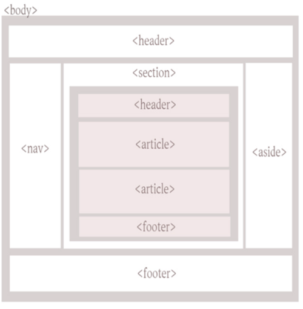

# HTML5

HTML5는 HyperText Markup Language의 5번째 버전으로, 웹 페이지 및 애플리케이션을 만드는 데 사용되는 마크업 언어입니다. HTML5는 W3C(웹 표준화 기구)가 개발한 표준이며, 이전 버전인 HTML4와 XHTML 1.0의 문제점을 보완하고 기존의 표준을 발전시키는 목적으로 개발되었습니다.

HTML5는 다음과 같은 특징을 가지고 있습니다.

1. 시멘틱 마크업: HTML5는 시멘틱 마크업을 지원하여 콘텐츠의 의미와 목적을 명확하게 나타내어 검색 엔진 최적화 및 웹 접근성을 개선합니다.

2. 멀티미디어 지원: HTML5는 비디오 및 오디오 콘텐츠를 웹 페이지에서 쉽게 재생할 수 있도록 지원합니다. 이전에는 플래시나 외부 플러그인이 필요했지만, HTML5는 내장된 비디오 및 오디오 태그를 지원하여 브라우저에서 직접 재생할 수 있습니다.

3. 오프라인 웹 애플리케이션: HTML5는 오프라인 상태에서도 작동하는 웹 애플리케이션을 만들 수 있도록 지원합니다. 이를 가능하게 하는 기술로 로컬 저장소, 웹 소켓 등이 있습니다.

4. 반응형 웹 디자인: HTML5는 반응형 웹 디자인을 지원하여 다양한 디바이스에서 웹 페이지가 최적의 화면에 맞게 표시되도록 합니다.

5. 간결한 문법: HTML5는 기존의 XHTML 1.0보다 간결한 문법을 제공하여 작성 및 유지보수가 쉽고 효율적입니다.

6. HTML5는 현재 웹에서 가장 많이 사용되는 마크업 언어 중 하나이며, 모바일 기기 및 태블릿 PC 등 다양한 디바이스에서도 잘 작동합니다. HTML5의 등장으로 웹 개발자들은 더욱 다양하고 풍부한 웹 경험을 제공할 수 있게 되었습니다.

## HTML5 Tag

HTML5 에서 쓸 수 있는 태그는 다음과 같다.
### 헤딩 태그 (Heading Tags)
h1, h2, h3, h4, h5, h6
````html
<h1>가장 큰 제목</h1>
<h6>가장 작은 제목</h6>
````

### 문단 태그 (Paragraph Tags)
p
````html
<p> 인라인이 아닌 블록 태그, 한 줄 을 다 차지함</p>
````
### 링크 태그 (Link Tags)
a
```html
<a href="https://google.com">google</a>
google 이라는 이름의 링크가 생긴다.
```
### 이미지 태그 (Image Tags) 
img
```html

```
### 리스트 태그 (List Tags) 
ul, ol, li
```html
<li>
    <ol>ordered list의 줄임말이다.</ol>
    <ol>앞에 숫자가 붙는다.</ol>
</li>

<li>
    <ul>unordered list의 줄임말이다.</ul>
    <ul>앞에 점이 붙는다.</ul>
</li>
```
### 폼 태그 (Form Tags)
form 태그는 웹 페이지에서 입력 양식(form)을 만드는 데 사용됩니다.<br>
이 태그를 사용하면 사용자로부터 정보를 수집하거나 데이터를 제출할 수 있는 양식을 만들 수 있습니다.<br> 
form 태그는 "action" 속성과 "method" 속성을 가집니다.<br> 
"action" 속성은 양식 데이터를 전송할 URL을 지정하며, "method" 속성은 데이터를 전송하는 방법을 지정합니다.<br>
대부분의 경우, "method" 속성은 "GET" 또는 "POST" 중 하나를 사용합니다.<br> 
form 태그 내부에는 여러 가지 입력 요소(input element)를 사용할 수 있습니다.<br>
일반적인 입력 요소에는 텍스트 상자(text box), 라디오 버튼(radio button), 체크 박스(checkbox), 드롭다운 목록(drop-down list) 등이 있습니다.<br>

```html
<form action="/submit-form" method="POST">
  <label for="name">이름:</label>
  <input type="text" id="name" name="name"><br><br>
  
  <label for="email">이메일:</label>
  <input type="email" id="email" name="email"><br><br>
  
  <label for="message">메시지:</label>
  <textarea id="message" name="message"></textarea><br><br>
  
  <input type="submit" value="제출">
</form>

```
위의 예제에서는 사용자로부터 이름, 이메일, 메시지를 입력받는 양식을 만들고 있습니다.<br> 
"action" 속성은 "/submit-form"으로 지정되어 있으므로, 사용자가 제출 버튼을 클릭하면 해당 URL로 양식 데이터가 전송됩니다.<br>
"method" 속성은 "POST"로 지정되어 있으므로, 데이터는 HTTP POST 요청으로 전송됩니다.<br>


### 테이블 태그 (Table Tags)
table : 테이블을 정의<br>
tr : row 를 정의<br>
th : header 를 정의<br>
td : table 의 data 를 정의<br>
colspan = "?" : ? 만큼의 column 을 먹는다. <br>
rowspan = "?" : ? 만큼의 row 를 먹는다.
```html
<table border="1">
    <tr><th colspan="3">이름,고향,나이</th></tr>
    <tr><td rowspan="3">ㅋㅋㅋㅋ</td><td>쌍문동</td><td>10</td></tr>
    <tr><td>깐따비아</td><td>9</td></tr>
    <tr><td>깐따비아</td><td>9</td></tr>
    <tr><td>또치</td><td>아프리카</td><td>10</td></tr>
</table>
```
### 멀티미디어 태그 (Multimedia Tags)

audio 태그: 오디오 파일을 웹 페이지에 삽입하는 데 사용됩니다. 
audio 태그는 "src" 속성을 사용하여 오디오 파일의 URL을 지정하고, "controls" 속성을 사용하여 사용자가 오디오를 재생, 일시 중지, 볼륨 조절 등을 할 수 있도록 합니다.
````html
<audio src="audiofile.mp3" controls></audio>
````

video 태그: 비디오 파일을 웹 페이지에 삽입하는 데 사용됩니다. video 태그는 audio 태그와 유사하게 "src" 속성을 사용하여 비디오 파일의 URL을 지정하고, "controls" 속성을 사용하여 사용자가 비디오를 재생, 일시 중지, 볼륨 조절 등을 할 수 있도록 합니다
```html
<video src="videofile.mp4" controls></video>
```

iframe 태그: 다른 웹 페이지를 현재 웹 페이지 안에 삽입하는 데 사용됩니다. 
iframe 태그는 "src" 속성을 사용하여 삽입할 웹 페이지의 URL을 지정합니다.
````html
<iframe src="http://www.example.com"></iframe>
````


### 시멘틱 태그 (Semantic Tags)
header : 헤더를 정의하는 시멘틱 태그<br>
nav : navigation bar 를 정의하는 시멘틱 태그<br>
section : section 을 정의하는 시멘틱 태그<br>
article : article 을 정의하는 시멘틱 태그<br>
aside : aside 를 정의하는 시멘틱 태그<br>
footer : footer 를 정의하는 시멘틱 태그<br>


### 스타일 및 스크립트 태그 (Style and Script Tags)
style : style 태그를 이용하면 선택자를 사용하여 body 의 스타일을 지정할 수 있다.<br>
script : script 태그를 이용하면 javascript 를 사용할 수 있다.<br>

css 에서 다룬다.


#DOM 프로그래밍
> DOM (Document Object Model) 프로그래밍은 JavaScript를 사용하여 HTML 문서의 구조와 콘텐츠에 대한 접근과 조작을 가능하게 하는 프로그래밍 기술.

```html
<!DOCTYPE html>
<html>
<head>
	<title>DOM Programming Example</title>
</head>
<body>
	<div id="myDiv">이것은 DOM 프로그래밍 예제입니다.</div>
	<script>
		var myDiv = document.getElementById("myDiv");
		myDiv.innerHTML = "Hello, World!";
	</script>
</body>
</html>
```
HTML 문서는 일련의 요소(element)로 구성되어 있으며, DOM은 이러한 요소들을 계층 구조로 구성하여 나타냅니다. 각 요소는 객체(object)로 표현되며, JavaScript를 사용하여 이러한 객체에 접근하고 조작할 수 있습니다.

DOM 프로그래밍을 사용하면, HTML 문서의 콘텐츠를 동적으로 변경하거나, 새로운 요소를 추가하거나, 기존 요소를 제거할 수 있습니다. 또한, 사용자가 이벤트를 발생시키는 것에 반응하여 문서의 콘텐츠를 동적으로 변경할 수도 있습니다.

예를 들어, 위의 코드는 HTML 문서에서 id가 "myDiv"인 요소를 선택하고, 해당 요소의 콘텐츠를 "Hello, World!"로 변경하는 예제입니다.

이 예제에서는 JavaScript를 사용하여 "myDiv"라는 ID를 가진 요소를 선택하고, 해당 요소의 내용을 변경하는 방법을 보여줍니다. 
이와 같이 DOM 프로그래밍을 사용하면 HTML 문서를 동적으로 조작하여 사용자에게 더 풍부하고 인터랙티브한 경험을 제공할 수 있습니다.