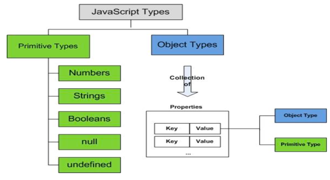

# CSS
> 구조적으로 짜여진 문서(HTML,XML)에 Style(글자,여백,레이아웃)을 적용하기 위해 사용 하는 언어(Language).

W3C의 표준이며 HTML구조는 그대로 두고 CSS 파일만 변경해도 전혀 다른 웹사이트처럼 꾸밀 수 있다.

## 장점
- 확장성 : 표현을 더욱 다양하게 확장하거나 표현 기능의 변경 가능 
- 편의성 : 훨씬 간편하게 레이아웃등의 스타일 구성 
- 재사용성 : 독립된 스타일 모듈 작성, 여러 HTML 문서에 공통으로 활용 
- 생산성 : 역할 분담에 따른 전문화,모듈 단위의 협업과 생산성의 향상

## 선택자
> CSS (Cascading Style Sheets) 선택자는 HTML 요소를 선택하고, 해당 요소에 스타일을 적용하는 데 사용됩니다. 
> CSS 선택자는 여러 가지 종류가 있으며, 각 선택자는 다른 방식으로 HTML 요소를 선택합니다

태그 선택자 (tag selector): HTML 요소의 태그 이름으로 선택합니다. 예를 들어, "p" 선택자는 모든 p 요소를 선택합니다.

클래스 선택자 (class selector): HTML 요소의 클래스 이름으로 선택합니다. 예를 들어, ".myClass" 선택자는 클래스 이름이 "myClass"인 모든 요소를 선택합니다.

ID 선택자 (ID selector): HTML 요소의 ID 이름으로 선택합니다. 예를 들어, "#myId" 선택자는 ID 이름이 "myId"인 요소를 선택합니다.

하위 선택자 (descendant selector): 특정 HTML 요소의 하위 요소를 선택합니다. 예를 들어, "ul li" 선택자는 ul 요소의 모든 li 하위 요소를 선택합니다.

자식 선택자 (child selector): 특정 HTML 요소의 직접적인 자식 요소를 선택합니다. 예를 들어, "ul > li" 선택자는 ul 요소의 직접 자식인 li 요소만 선택합니다.

가상 클래스 선택자 (pseudo-class selector): HTML 요소의 특정 상태를 선택합니다. 예를 들어, ":hover" 선택자는 마우스 커서가 해당 요소 위에 있을 때 선택합니다.

CSS 선택자는 다양한 방식으로 조합하여 사용할 수 있습니다.
이러한 선택자를 사용하여 HTML 요소를 선택하고, 선택한 요소에 원하는 스타일을 적용하여 웹 페이지의 디자인을 개선할 수 있습니다.
---
# JavaScript
> 웹 페이지를 동적으로 만드는 데 사용되는 객체 기반 스크립트 프로그래밍 언어, HTML5 공식 API

## 특징
1. 웹 페이지를 동적으로 만드는 데 사용되는 프로그래밍 언어
2. 웹 브라우저에서 사용되며 사용자와 상호작용할 수 있는 기능을 제공함.
3. 웹 페이지의 스타일, 콘텐츠, 동작 등을 동적으로 제어하여 웹 개발을 더욱 풍부하고 유연하게 만들어주는 필수적인 요소입니다.
4. 브라우저에서 코드를 볼 수 있다.(보안 이슈 o)

## 활용범위
- 웹 클라이언트 개발 
  - 자바스크립트는 웹 페이지의 동작을 제어하고, 사용자와의 상호작용을 처리하는 데 사용됩니다. 이를 통해 인터랙티브한 웹 페이지를 구현하고, 사용자 경험을 향상시킬 수 있습니다. 또한, 자바스크립트는 HTML, CSS와 함께 사용되어 웹 페이지의 레이아웃 및 디자인을 동적으로 변경할 수 있습니다.

- 웹 서버 개발
  - 자바스크립트는 Node.js를 통해 서버 측에서도 사용될 수 있습니다. 
Node.js는 자바스크립트를 사용하여 서버를 개발할 수 있는 플랫폼이며, 대규모 웹 애플리케이션의 개발에 사용됩니다. Node.js는 HTTP, HTTPS 등의 프로토콜을 지원하며, 데이터베이스 연결, 파일 시스템 접근 등의 기능을 제공합니다.

- 어플리케이션 개발
  - 자바스크립트는 모바일 어플리케이션, 데스크톱 어플리케이션, 게임 등 다양한 어플리케이션의 개발에도 사용됩니다. React Native와 같은 프레임워크를 사용하면 자바스크립트를 사용하여 iOS, 안드로이드 등 다양한 플랫폼에서 동작하는 모바일 애플리케이션을 개발할 수 있습니다. 또한, Electron과 같은 프레임워크를 사용하면 자바스크립트를 사용하여 데스크톱 애플리케이션을 개발할 수 있습니다. 게임 엔진인 Unity에서도 자바스크립트를 지원하며, 자바스크립트를 사용하여 게임을 개발할 수 있습니다.

## JavaScript 코드 작성 위치
자바스크립트 코드는 HTML 문서에서 <head> 태그 내부 또는 <body> 태그 내부 어디에서든지 작성할 수 있습니다. 그러나, 일반적으로는 <body> 태그의 가장 마지막 부분에 작성하는 것이 좋습니다.

그 이유는, 웹 페이지가 로딩될 때 HTML 문서의 내용은 순차적으로 파싱되고, 실행되기 때문입니다. 이 과정에서 HTML 코드와 함께 자바스크립트 코드도 순차적으로 파싱되고, 실행됩니다. 따라서, 자바스크립트 코드가 HTML 코드보다 먼저 실행되는 경우, 해당 코드가 의도한대로 동작하지 않을 수 있습니다.

예를 들어, 자바스크립트 코드가 HTML 문서의 요소를 조작하거나, 이벤트를 처리하는 경우, HTML 문서가 로드되지 않은 상태에서 이러한 코드가 실행될 경우 오류가 발생할 수 있습니다. 이를 방지하기 위해, HTML 문서가 완전히 로드된 후에 자바스크립트 코드가 실행되도록 하기 위해 <body> 태그의 가장 마지막 부분에 자바스크립트 코드를 작성하는 것이 좋습니다.

또한, 이 방법은 사용자 경험을 개선할 수도 있습니다. 자바스크립트 코드가 HTML 문서의 요소를 조작하거나, 이벤트를 처리하는 경우, 사용자가 해당 요소를 더 빨리 볼 수 있도록 HTML 코드가 먼저 렌더링되도록 할 수 있습니다.

따라서, 일반적으로는 <body> 태그의 가장 마지막 부분에 자바스크립트 코드를 작성하는 것이 좋습니다. 

## 자료형
JavaScript는 데이터 타입이 number, string, boolean, null, undefined 로 구분되는 기본형 탕비과 객체 타입으로 나뉜다.

숫자 타입 : 100, 3,14 
문자열 타입 : "가나다", 'abc' 
논리 타입 : true, false 

## 연산자
| 종류       | -                                                    |
|----------|------------------------------------------------------|
| 수치 연산자   | +,-,*,%,++,--                                        | 
| 비교 연산자   | >,<,>=,<=,==(타입이 달라도 비교함),===(타입도 체크),!=,!==         |
| 조건 연산자   | &&(a && b -> a가 true 일 때 b 라는 식을 수행할 수 있음),ㅣ,ㅣㅣ, ?,! |
| 대입 연산자   | =,+=,-=,*=,%=                                        |
| 비트 연산자   | &,ㅣ,^,<<,>>                                          |
| 타입 점검연산자 | typeof,instanceof                                    |
| 삭제 연산자   | delete                                               |

## 제어문
조건 제어문(if), 다중 분기문(switch),반복 제어문(for,while,do-while),분기 제어문(break,continue),예외처리 연산자(try-catch-finally)

## error
에러가 나면 해당 스크립트 태그만 처리안한다. 
하지만 다음 태그부터 실행이 다시 된다.

## API
- isNaN() : 숫자로 변경될 수 없으면 true
## var,let
let : block scope 를 지원한다.

## 서브창 출력
window.alert() : 경고창을 통해서 메시지를 알리는 서브창 출력 

window.prompt() : 필요한 데이터를 입력받는 역할의 서브창 출력(무엇을 입력하든 문자열이 전달됨) 
(입력없이 확인버튼 클릭되면 --> "") 
(취소버튼이 클릭되면 --> null ) 

window.confirm() : 양자 택일을 선택할 수 있는 역할의 서브창 출력 

?????
var, let let 이 나온 이유?
?????