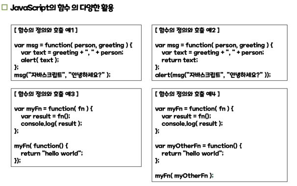

## pre 태그
pre 태그는 "preformatted text"를 나타내는 태그로, 텍스트를 서식 있는 그대로 표현합니다.<br> 
일반적으로 HTML에서 텍스트는 여백과 줄 바꿈을 무시하고, 한 줄로 이어져서 표시됩니다.<br> 
그러나 pre 태그를 사용하면 여백과 줄 바꿈을 유지하며, 고정폭 글꼴을 사용하여 텍스트를 표시합니다.<br>

- 예시
```javascript
<pre>
    <script>
        document.write("dsd");
        document.write("dsd");
    </script>
</pre>
// 자동으로 띄어쓰기가 적용되는데 pre 태그가 구문을 텍스트 서식 그대로 표현하기 때문이다.
```

## JavaScript의 함수 정의와 활용

### 선언적(명시적) 함수의 정의 방법
````javascript
function myfunction(인자){
//    do something
}
````

### 표현식(익명) 함수 정의 방법
```javascript
var myFunction = function(인자){
//    do something
}
```

### 함수 활용예시 
자바스크립트는 함수를 일반 변수처럼 다룰 수 있다.

리턴값이 없는 함수는 undefined 형태가 된다.

# JavaScript 의 배열

## JavaScript 배열의 특징
- 객체로 취급된다.
- 배열을 구성하는 각 데이터들을 요소라고 한다.
- 배열의 요소 개수를 가변적으로 처리할 수 있다. 배열을 생성할 때 크기를 지정하더라도 필요하다면 배열을 구성하는 요소의 개수를 늘리는 것이 가능하다. 
- 배열에 저장할 수 있는 데이터의 타입에 제한이 없다. 배열을 구성하는 각 요소마다 다른 타입의 데이터를 저장하고 사용하는 것이 가능하다. 
- length 라는 속성을 사용하여 배열을 구성하고 있는 요소의 개수를 추출할 수 있다.
- 배열을 생성하여 변수에 담아 사용한다.

## JavaScript의 배열 생성 방법 2가지
- 배열 리터럴을 사용하는 방법(자동으로 배열 객체가 된다.)
  [1,2,3,4,5]
- Array() 라는 생성자 함수를 호출하여 배열 객체를 생성하는 방법
  new Array(10)

## 배열 정렬
````javascript
//문자열기반 sort
var ary1 = ['둘리', '또치', '도우너', '희동이', '고길동']
ary1.sort();

// 문자열기반이지만 숫자도 문자열기반 sort가 되므로 숫자를 sorting 하려면 인자를 주어야한다.
var ary3 = [30, 11, 5, 27, 9]
document.write(ary3.sort(function(a, b){ return a - b;}) + "<br>");
````


