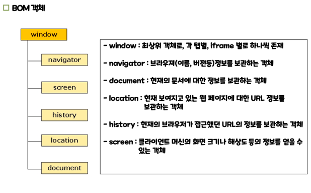

# JavaScript 의 객체 선언과 활용

## JavaScript 객체의 특징

- 객체란 이름과 값을 가진 data(Property) 의 집합 및 data 를 조작하기 위한 Method 가 하나로 묶인 것이다.(Java 의 객체와 유사함)

- JavaScript 에서 객체는 Property 의 집합과 하나의 prototype object 을 가지고 있다 .
- Method 는 함수가 값으로 저장된 객체의 Property 로서, 객체의 속성을 취득 및 변경 하기 위한 창구이다. 객체의 프로퍼티에 할당되어 객체를 통해서 호출되는 함수를 메서드라 부른다.
- 객체의 속성과 메서드는 동적으로 추가하거나 삭제하는 것이 가능하다.
- 상속구문도 적용되어 JavaScript 에서 생성되는 모든 객체들은 조상 객체로 Object 객체를 갖는다.
- JavaScript 의 함수는 실행 가능한 코드와 연결된 객체라 할 수 있다.
- map 자료구조라고 생각하면 편하다.(외부에서 변수 추가 가능)

## 객체 정의

JavaScript의 객체 생성 방법은 2가지가 지원된다.

### 객체 리터럴을 사용하는 방법

```javascript
{
    속성명:속성값, 속성명
:
    속성값
...
}
```

### 생성자 함수를 사용하는 방법

> 생성자 함수란 객체를 초기화(속성과 메서드를 정의)하기 위해 사용되는 함수로서 관례적으로 생성자 함수의 명칭은 첫 글자를 대문자로 사용한다.

````javascript
function 함수명([매개변수]) {
    this.속성명 = 값;
    this.속성명 = 값;
...
}

new 함수명()
````

### 변수, 함수 사용 예시

- 프로퍼티에 접근할 때 this 를 무조건 붙혀줘야한다.
- 변수와 메서드명이 같아도 동작한다.
-

```js
<script>
    const obj = {
    name : '듀크',
    eat : "먹음",
    eat : function(food) {
    alert(this.name + "가 " + food + "를 먹어요!!");
}
};
    obj.eat("사과");
    obj.eat;
</script>
```

### 동일한 사양을 갖는 객체가 여러개 필요한 경우

객체 리터럴 보다는 생성자 함수를 사용하는 것이 낫다.<br>
prototype 을 사용할 수 있다.<br>
prototype x -> 객체가 생성될 때마다 속성, 메서드의 메모리 할당이 일어난다.<br>
prototype o -> 같은 타입의 멤버에서 미리 메모리에 할당된 속성,메서드를 재사용 할 수 있다.<br>
객체 리터럴은 유틸 클래스 같은 거로 쓰일까? o
```js
<script>
    function Student(name, korean, math, english, science) {
        this.이름 = name;
        this.국어 = korean;
        this.수학 = math;
        this.영어 = english;
        this.과학 = science;
    }
    Student.prototype.toString = function() {
        return this.이름+ " :  " +
        this.국어+ ", " +
        this.수학+ ", " +
        this.영어+ ", " +
        this.과학
    }
    Student.prototype.사회 = 0;
    var st1 = new Student('둘리', 96, 98, 92, 98);
    var st2 = new Student('또치', 92, 98, 96, 98);
    var st3 = new Student('도우너', 76, 96, 94, 90);
</script>
```

## BOM(Browser Object Model)
> JavaScript 로 브라우저 또한 조작이 가능하다.


location.href 현재 웹페이지의 url 정보인데 이 정보를 변경하면 웹 페이지 이동을 한다. 
iframe 태그는 하나의 window 객체를 생성한다.

## DOM(Document Object Model)
> 객체 지향 모델로써 구조화된 문서를 표현하는 형식이다.

브라우저는 서버로부터 응답된 웹 컨텐트 내용을 파싱한 후 트리구조로 각 HTML 태그마다 DOM 기술을 적용하여 JavaScript 객체를 생성하는데 이 객체들을 DOM 객체라 한다.

DOM 객체를 통해서 HTML 문서의 내용에 접근하여 crud 를 할 수 있다.

그렇다면 javascript 가 읽을 수 있는 DOM 객체로 변환된 HTML 페이지를 BOM 객체 중 document 객체를 통해  조작하는것인가?
정답 : o

### DOM 객체 접근
DOM 객체를 접근할 때는 **직접 접근 방법**과 **노트 워킹 접근 방법**이 사용될 수 있다.

### 직접접근방법
원하는 DOM 객체에 접근하기 위해서는 document 객체에서 제공되는 다음 메서드들을 사용한다.
- document.getElementsByTagName('태그명') 태그명으로 DOM 객체들을 찾음 -> NodeList
- document.getElementById ('id속성값') 태그에 정의된 id 속성의 값으로 DOM 객체를 찾음 -> Node
- document.getElementsByClassName('class속성값') 태그에 정의된 class 속성의 값으로 DOM 객체들을 찾음 ->NodeList
- document.querySelector('#id, #class,#') 선택자에 알맞은 DOM 객체를 찾음 -> Node
- document.querySelectorAll('#찾고자 하는 DOM 객체에대한 CSS 선택자') 선택자에 알맞은 DOM 객체들을 찾음 -> NodeList
- 문자열로 정의된 엘리먼트의 컨텐트 내용을 추출하려면 node.nodeValue를 사용한다.
- 문자열로 정의된 엘리먼트의 컨텐트 내용을 추출하려면 node.textContent 사용한다.
- 종류에 관계없이 엘리먼트의 컨텐트 내용을 추출하려면 node.innerHTML 을 사용한다.
- 엘리먼트에 정의된 속성을 접근하기 위해서는 node.getAttribute('속성명')을 사용한다.

## 함수 선언식과 함수 표현식
둘 다 JavaScript 에서 함수를 정의하는 방법이다.
```js
// 예시1. 함수 선언식 : 말 그대로 함수를 선언하는 식이다. 
function func(){
    return 100;
}
// 예시2. 함수 표현식 : 말 그대로 함수를 표현하는 식이다. 
var func = function(){
    return 100;
}
```
그런데 script 에서 함수를 사용하는 구문뒤에 함수를 정의하면 어떤일이 일어날까?
## 호이스팅
> JavaScript 에서 변수와 함수 선언식을 해당 스코프의 맨위로 끌어올리는 작업을 의미한다.

## 호이스팅의 특징
호이스팅은 JavaScript 엔진에 의해 처리된다.
 
```js
console.log(x); // undefined
var x = 5;

hello();

function hello() {
  console.log('Hello, world!');
  var x = 1;
}
```
위의 예제에서는 JavaScript 엔진이 작동할 때 호이스팅을 거쳐서 다음과 같이 변환됩니다.
````js
var x;

function hello() {
    var x;
    console.log('Hello, world!');
    x = 1;
}

console.log(x); // undefined

x = 5;

hello();
````

# 웹서버에서 받은 응답을 브라우저가 표현할 때까지 일어나는 과정
1. 웹 서버에서 HTML, CSS, JavaScript 등의 파일을 응답으로 전송합니다.
2. 브라우저는 브라우저 엔진의 HTML 파서를 이용하여 HTML 파일을 파싱하여 DOM(Document Object Model)을 생성합니다.
3. HTML 파싱 과정에서, JavaScript 엔진이 실행됩니다. JavaScript 코드가 있을 경우, JavaScript 엔진은 코드를 해석하고 실행합니다.
4. DOM 생성이 완료되면, CSS 파일을 로드하여 레이아웃을 계산합니다.
5. 브라우저는 DOM과 CSS를 조합하여 화면을 그리기 위해 렌더 트리(Render Tree)를 생성합니다. 이 때, 브라우저는 렌더링을 최적화하기 위해 CSS 파싱과 레이아웃 계산을 함께 수행합니다.
6. 렌더 트리가 생성되면, 브라우저는 렌더 트리를 기반으로 화면을 그리기 시작합니다. 이 과정에서 픽셀 단위의 렌더링이 수행됩니다.
이러한 과정에서, JavaScript 코드가 있을 경우 JavaScript 엔진은 HTML 파싱 과정에서 실행되며, DOM 생성과 조작, 이벤트 처리 등의 작업을 수행합니다.

따라서, JavaScript 엔진은 HTML 파싱 과정에서 실행되며, 브라우저와 함께 HTML 파일 렌더링과 DOM 조작, 이벤트 처리 등의 작업을 수행합니다.
결론: html,css,js -> html paser -> dom -> redered page
