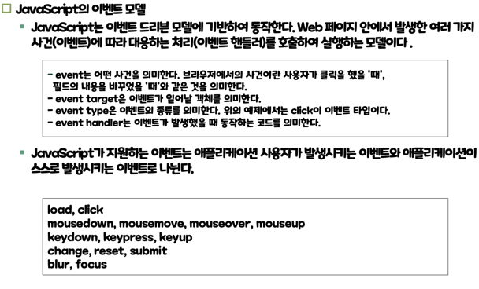

# JavaScript 이벤트 모델
> HTML 문서에서 발생하는 이벤트를 처리하기 위한 방법론.

특징: 이벤트를 발생시키는 객체와 이벤트를 처리하는 객체를 분리하여 관리하며 
이를 통해 코드의 재사용성과 유지보수성을 높이는 것이 가능하다.
## JavaScript 이벤트 모델의 종류


## JavaScript 이벤트 모델에 이벤트를 연결하는 방법
JavaScript 이벤트 모델에 이벤트를 연결하는 방법은 세 종류가 있다.
1. 인라인 이벤트 모델
2. 고전 이벤트 모델
3. 표준 이벤트 모델
### 인라인 이벤트 모델
> HTML 태그의 속성으로 이벤트 핸들러 함수를 등록하는 방식입니다.
````js
예시1. 하나의 button 태그에 onclick 이라는 이벤트 핸들러 함수를 정의,등록했다.
<button onclick="alert('Hello, world!')">Click me</button>

예시2. 함수를 외부에 정의하고 input 태그에 onclick 이벤트를 등록했다.
<script>
    function btn_onclick(){ window.alert(‘안녕?');
}
</script>
<input type="button" value="다이얼로그 표시" onclick="btn_onclick()“>

````
단점 : 내장 이벤트를 쓰거나 함수를 외부에 정의한다해도, 이벤트를 처리하는 코드자체는 HTML 태그 안에 위치하므로, 코드의 가독성과 유지보수성이 낮아질 수 있다.

이 단점을 해결하려면 어떻게 해야할까? 인라인 모델은 유지보수성이 떨어지므로 따로 밖으로 빼서 이벤트를 핸들링하면 된다.

여기서 나온것이 event-listener 모델이다.

event-listener 모델은 이벤트 핸들러 함수를 JavaScript 코드로 작성하여 등록하는 방법이다.
```js
<button id="my-button">Click me</button>

<script>
  const button = document.querySelector('#my-button');
  button.addEventListener('click', function() {
    alert('Hello, world!');
  });
</script>
```
event-listener 모델을 사용함으로써 이벤트 핸들러 함수는 태그가 아닌 별도의 JavaScript 코드에 작성되므로 코드의 가독성과 유지보수성을 높힐 수 있다.
### 고전 이벤트 모델
태그의 DOM 객체를 찾고 찾은 DOM 객체를 처리하는 이벤트 핸들러 함수를 등록한다.
```js
예시1. window 가 load 되면 btn 이라는 id 를 가진 태그에 함수를 부여한다.
<script>
    window.onload = function() { 
        document.getElementById('btn').onclick= function(){
        window.alert('안녕?'); 
        };
    }; 
</script>
<input id="btn" type="button" value="다이얼로그 표시“>
```
단점 : 이벤트 함수를 하나만 등록할 수 있기 때문에 유지보수성이 떨어진다.

이를 해결하기 위해 표준 이벤트 모델은 여러 함수를 등록 할 수 있는 기능을 제공한다. 
### 표준 이벤트 모델
위의 인라인 이벤트 모델의 단점을 설명하며 나온 이벤트 모델이다.<br>
addEventListener 와 removeEventListener 와 이벤트 객체.preventDefault() 가 있다.<br>
preventDefault() -> 방어 기본 -> 기본값을 주지 않는다.<br> 
표준 이벤트 모델의 이벤트(함수)에는 인자를 주지 못한다.<br>
````js
예시1. 이벤트에 변수를 주는 경우(비정상) 
object.addEventListener('click',func(e));
예시2. 정상
object.addEventListener('click',func);
````
함수 내에서는 e 매개변수를 사용하거나 this 를 통해서 이벤트가 발생한 객체에 접근할 수 있다.<br>
````js
// 예시
function func(e){
    e.target.color = "blue";
    this.color = "blue";
}
````

### 이벤트 핸들러 함수의 인자
이벤트 핸들러 함수의 인자에는 이벤트 객체가 들어온다.
이벤트 객체.target 은 이벤트가 발생된 객체가 반환된다.
this 는 이벤트가 발생된 객체를 가르킨다.
```js
function f2(e) {
    alert(e);
    alert(e.target.textContent);
    alert(this.textContent);
} 
```

## 이벤트 버블링과 이벤트 캡처링
해당 요소의 이벤트가 발생했을 때 상위 요소에도 해당 이벤트가 있을 경우 상위 요소에서도 이벤트가 발생한다.(이벤트 캡처링)<br>
이벤트 전파를 중지하려면 event.stopPropagation() 메서드를 사용할 수 있다.<br> 
이 메서드를 호출하면 이벤트가 전파되지 않으며, 이벤트 처리가 중단된다.<br>
이벤트의 e.currentTarget -> 이벤트 핸들링을 하는 요소<br>
this -> 이벤트 핸들링을 하는 요소


