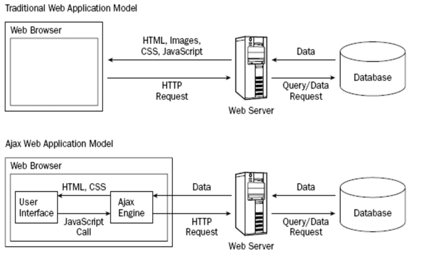

# XML(Extensible Markup Language)

> 규격화 된 문서를 만드는 마크업 언어, 태그를 목적에 알맞게 직접 설계한다.

# JSON(JavaScript Object Notation)

> 인터넷에서 자료를 주고 받을 때 그 자료를 표현하는 방법

## 특징

1. single quotation 이 안되고 무조건 double 을 써야 한다.
2. {} 는 json 형식에 [] 는 배열 형식에 쓴다.

## 왜 배우는가?

서버의 응답을 받을 때 JSON, HTML, XML, Plain Text 등이 있기 때문.

# AJAX(Asynchronous JavaScript and XML)

> JS 와 XML 을 이용하여 서버와 통신하는 방식

## 왜 배우는가?

기존의 통신방식은 전체 페이지를 로드했는데 웹페이지를 일부분만 바꿀 떄는 효율적으로 손해이다. 따라서 AJAX 기술을 이용해서 웹 페이지의 일부만 끌고오는 비동기 통신을 할 수 있기 때문에 배워야한다.

__기존의 웹 페이지와 AJAX 를 사용한 웹 통신 비교__


## 사용법

```js
const xhr = new XMLHttpRequest();
// XMLHttpRequest 객체 생성
xhr.onload = function () {
    // 서버로부터 응답이 도착했을 때 수행할 내용
}
xhr.open('GET', 'content/sample.xml', true);
// 송신할 요청을  build 하는 메서드이고 첫 번째 인자는 요청 방식(GET, POST 등)을, 두 번째 인자는 요청 URL을, 세 번째 인자는 요청 방식이 비동기적인지 동기적인지를 나타내는 값(true/false)을 전달합니다. 
xhr.send();
// 요청을 송신
```

# 클라이언트가 요청을 보내는 방식

## GET

요청 대상 URL 문자열 뒤에 ? 기호와 함꼐 추가되서 전달, 길이에 제한,외부로 보여진다.(비밀번호에는 못쓴다.) --> 쿼리 문자열

## POST

요청 바디안에 담아서 전달, 길이에 제한 보여지지 않는다. --> 요청 파라미터에 담아서 전달

???? 비동기 통신과 동기 통신 ajax 통신과정 p123 ????


