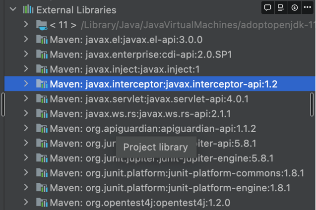
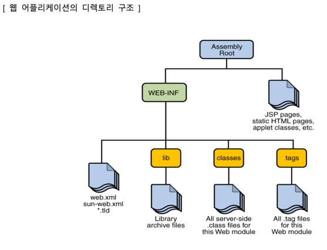

# ES6 문법
````js
// 템플릿 리터럴 방식(` 기호는 백틱 기호)
console.log(`이건 ${jsname}입니다.`);

// 여러 변수 대입
const introduce = { name: 'unico', age: 23 };
const { name, age } = introduce;

// 기본값 매개변수
function func2(a = 10, b = 20, c = 30) {
    return a + b + c;
}

let obj = { name : myName };
obj = { myName }; // {myName : myName} 과 동일

for (let i in ary)
    writeColor(i, "h4", "green");

for (let e of ary)   // of 반복문은 요소를 꺼내준다.
    writeColor(e, "h4", "green");

//js 로 ajax 요청하는법
window.addEventListener("load", function() {
    fetch('/edu/jsexam/ajaxexam/content/sample.json')
        .then(res => res.json())
        .then( data => {
            for (let k in data)
                document.body.innerHTML += `<h3>${data[k]}</h3`;
        });
});
````

#  JAVA EE(Enterprise Edition)
> 자바 기반의 웹 어플리케이션과 서버 애플리케이션을 개발하기 위한 플랫폼.
> 주로 

## 특징

Java EE는 자바 SE(Java Platform, Standard Edition)를 기반으로 하여 웹 어플리케이션과 서버 애플리케이션을 구축하기 위한 다양한 기술과 API를 제공합니다.<br> 
Java EE 플랫폼을 이용하면 대규모 기업용 애플리케이션 개발에 필요한 보안, 트랜잭션 처리, 웹 서비스 등의 기능을 쉽게 개발할 수 있습니다.<br> 
Java EE에는 Servlet, JSP, EJB, JPA 등 다양한 기술이 포함되어 있습니다.<br>
Java EE는 대규모 기업용 애플리케이션 개발에 적합한 플랫폼으로 폭넓게 사용되고 있습니다.<br>

# 웹 어플리케이션의 디렉토리 구조

# Servlet(Server Side Applet)
> Servlet은 Java 언어로 작성된 웹 어플리케이션의 일부로서, HTTP 요청과 응답 프로토콜을 처리하는 Java 클래스입니다.

## 등장배경
기존의 CGI 기술은 요청마다 새로운 프로세스를 생성했고 이는 메모리 용량, 컨텍스트 스위칭에서 비용이 발생했다.<br>
Servlet은 요청마다 새로운 쓰레드를 생성하여 시스템 자원 소모와 프로세스간 통신 오버헤드가 적다.<br>
결론: 쓰레드는 프로세스 내에서 공유하는 메모리 공간을 사용하기 때문에, 프로세스 간 통신이 필요 없어 더욱 효율적이다.<br>
이러한 이유로 Servlet이 CGI에 비해 더욱 효율적이다.<br>

## 특징
Servlet은 클라이언트에서 서버로 요청을 전달하면 서버에서 이를 처리하고, 결과를 다시 클라이언트로 전달해주는 역할을 합니다.<br>
클라이언트가 요청을 하면 쓰레드를 만들어서 요청을 처리한다.(멀티 쓰레드)<br>
doGet doPost 를 오버라이딩해서 구현한다.<br>
최초 사용시 객체가 생성된다.

## 사용법
Servlet 은 HttpServlet 이라는 클래스를 상속하여 구현한다.<br>
어떠한 요청 방식을 지원하는 Servlet 인가에 따라 doGet() 또는 doPost() 메서드를 오버라이딩하여 구현한다.<br>
HttpServletRequest request 은 요청 관련된 처리<br>
HttpServletResponse response 은 응답 관련된 처리를 할 때 사용된다.<br>
writer.print("<a href='"+req.getHeader("referer")+"'>입력화면으로 가기</a>");을 사용하여 이전화면으로 갈 수 있다.<br>


### Servlet 의 메서드
1. init() : init() 메서드는 서블릿이 처음 생성될 때 한 번 호출됩니다. 
   이 메서드는 초기화 작업을 수행하며, 보통 서블릿의 설정 정보를 읽어들이거나 데이터베이스와 연결을 설정하는 등의 작업을 수행합니다.<br>
2. destroy() : destroy() 메서드는 서블릿이 제거될 때 호출됩니다. 
   이 메서드는 서블릿이 사용한 리소스를 해제하거나, 데이터베이스와의 연결을 종료하는 등의 마무리 작업을 수행합니다.<br>
3. doGet() : doGet() 메서드는 클라이언트가 GET 방식으로 요청한 데이터를 처리하는 메서드입니다.
4. doPost() : 메서드는 클라이언트가 POST 방식으로 요청한 데이터를 처리하는 메서드입니다.
5. service() : service() 메서드는 클라이언트의 요청이 있을 때마다 호출됩니다.
   이 메서드는 실제로 요청을 처리하는 메서드이며, HttpServletRequest 객체를 통해 클라이언트의 요청 정보를 읽어들이고, HttpServletResponse 객체를 통해 클라이언트에게 응답을 보내는 작업을 수행합니다.<br>
   또한 request를 분석해서 내부에서 doGet() 또는 doPost()를 수행합니다.
```java
protected void service(HttpServletRequest request, HttpServletResponse response) throws ServletException, IOException {
    String method = request.getMethod();
    if (method.equals("GET")) {
        doGet(request, response);
    } else if (method.equals("POST")) {
        doPost(request, response);
    }
}
```

## Servlet 의 요청 재지정
forward 는 같은 어플리케이션에서만 redirect가 가능하다.

???????
servlet은 HttpServlet 을 구현하여 구현하는데 이 구조를 알고싶다.
서블릿은 객체가 한 번 생성된다. -> 한 번 진짜 그러나 보자
서블릿객체는 jvm 에서 어디에 올라가는가
여기서 서블릿 객체란 HttpServlet을 구현 한 객체를 말하는 것인가?
물건을 담을 때 세션에 담는데 세션은 언제 생성되고 없어지는가?
세션은 jvm 중 어디에 생성되는가?
getHeader(referrer)은 뭔가
??????