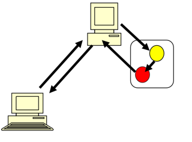
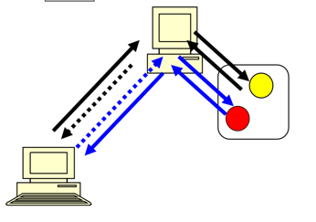

# ES6 문법
````js
// 템플릿 리터럴 방식(` 기호는 백틱 기호)
console.log(`이건 ${jsname}입니다.`);

// 여러 변수 대입
const introduce = { name: 'unico', age: 23 };
const { name, age } = introduce;

// 기본값 매개변수
function func2(a = 10, b = 20, c = 30) {
    return a + b + c;
}

let obj = { name : myName };
obj = { myName }; // {myName : myName} 과 동일

for (let i in ary)
    writeColor(i, "h4", "green");

for (let e of ary)   // of 반복문은 요소를 꺼내준다.
    writeColor(e, "h4", "green");

//js 로 ajax 요청하는법
window.addEventListener("load", function() {
    fetch('/edu/jsexam/ajaxexam/content/sample.json')
        .then(res => res.json())
        .then( data => {
            for (let k in data)
                document.body.innerHTML += `<h3>${data[k]}</h3`;
        });
});
````

#  JAVA EE(Enterprise Edition)
> 자바 기반의 웹 어플리케이션과 서버 애플리케이션을 개발하기 위한 플랫폼.
> 주로 

## 특징

Java EE는 자바 SE(Java Platform, Standard Edition)를 기반으로 하여 웹 어플리케이션과 서버 애플리케이션을 구축하기 위한 다양한 기술과 API를 제공합니다.<br> 
Java EE 플랫폼을 이용하면 대규모 기업용 애플리케이션 개발에 필요한 보안, 트랜잭션 처리, 웹 서비스 등의 기능을 쉽게 개발할 수 있습니다.<br> 
Java EE에는 Servlet, JSP, EJB, JPA 등 다양한 기술이 포함되어 있습니다.<br>
Java EE는 대규모 기업용 애플리케이션 개발에 적합한 플랫폼으로 폭넓게 사용되고 있습니다.<br>

# 웹 어플리케이션의 디렉토리 구조

# Servlet(Server Side Applet)
> Servlet은 Java 언어로 작성된 웹 어플리케이션의 일부로서, HTTP 요청과 응답 프로토콜을 처리하는 Java 클래스입니다.

## 등장배경
기존의 CGI 기술은 요청마다 새로운 프로세스를 생성했고 이는 메모리 용량, 컨텍스트 스위칭에서 비용이 발생했다.<br>
Servlet은 요청마다 새로운 쓰레드를 생성하여 시스템 자원 소모와 프로세스간 통신 오버헤드가 적다.<br>
결론: 쓰레드는 프로세스 내에서 공유하는 메모리 공간을 사용하기 때문에, 프로세스 간 통신이 필요 없어 더욱 효율적이다.<br>
이러한 이유로 Servlet이 CGI에 비해 더욱 효율적이다.<br>

## 특징
Servlet은 클라이언트에서 서버로 요청을 전달하면 서버에서 이를 처리하고, 결과를 다시 클라이언트로 전달해주는 역할을 합니다.<br>
클라이언트가 요청을 하면 쓰레드를 만들어서 요청을 처리한다.(멀티 쓰레드)<br>
doGet doPost 를 오버라이딩해서 구현한다.<br>
최초 사용시 객체가 생성된다.

## 사용법
Servlet 은 HttpServlet 이라는 클래스를 상속하여 구현한다.<br>
어떠한 요청 방식을 지원하는 Servlet 인가에 따라 doGet() 또는 doPost() 메서드를 오버라이딩하여 구현한다.<br>
HttpServletRequest request 은 요청 관련된 처리<br>
HttpServletResponse response 은 응답 관련된 처리를 할 때 사용된다.<br>
````js
writer.print("<a href='"+req.getHeader("referer")+"'<입력화면으로 가기</a>");을 사용하여 이전화면으로 갈 수 있다.<br>
````


### Servlet 의 메서드
1. init() : init() 메서드는 서블릿이 처음 생성될 때 한 번 호출됩니다. 
   이 메서드는 초기화 작업을 수행하며, 보통 서블릿의 설정 정보를 읽어들이거나 데이터베이스와 연결을 설정하는 등의 작업을 수행합니다.<br>
2. destroy() : destroy() 메서드는 서블릿이 제거될 때 호출됩니다. 
   이 메서드는 서블릿이 사용한 리소스를 해제하거나, 데이터베이스와의 연결을 종료하는 등의 마무리 작업을 수행합니다.<br>
3. doGet() : doGet() 메서드는 클라이언트가 GET 방식으로 요청한 데이터를 처리하는 메서드입니다.
4. doPost() : 메서드는 클라이언트가 POST 방식으로 요청한 데이터를 처리하는 메서드입니다.
5. service() : service() 메서드는 클라이언트의 요청이 있을 때마다 호출됩니다.
   이 메서드는 실제로 요청을 처리하는 메서드이며, HttpServletRequest 객체를 통해 클라이언트의 요청 정보를 읽어들이고, HttpServletResponse 객체를 통해 클라이언트에게 응답을 보내는 작업을 수행합니다.<br>
   또한 request를 분석해서 내부에서 doGet() 또는 doPost()를 수행합니다.
```java
protected void service(HttpServletRequest request, HttpServletResponse response) throws ServletException, IOException {
    String method = request.getMethod();
    if (method.equals("GET")) {
        doGet(request, response);
    } else if (method.equals("POST")) {
        doPost(request, response);
    }
}
```

# Servlet 의 요청 재지정
> 클라이언트가 요청한 페이지 대신 다른 페이지를 보게하는 방법

# forward
> 동일한 요청상에서 다른 자원에게 요청을 넘겨서 대신 응답하게 함


## 특징
1. 동일한 서버의 동일한 어플리케이션일 경우에만 사용 가능하다.(다른 서버거나 다른 웹 어플리케이션이면 요청을 하는것이 불가능하기 때문)
2. 브라우저에 표기되는 주소 필드의 URL 이 바뀌지 않음
3. 두 자원이 HttpServletRequest, HttpServletResponse 객체를 공유한다.
## 예시
```java
protected void doGet(HttpServletRequest request, HttpServletResponse response) throws ServletException, IOException {
		System.out.println("ForwardServlet 수행");
		RequestDispatcher rd = 
				request.getRequestDispatcher("/clientexam/output.html");
		rd.forward(request,  response);
	}
```
# redirect
> 사용자에게 다른 자원을 요청하게 한다.<br>


## 특징
1. Web 상의 모든 페이지로 요청 재지정가능
2. 브라우저의 주소필드의 URL 이 바뀜
3. 두 자원이 HttpServletRequest, HttpServletReqsponse  객체를 공유하지 않음
4. 두 번의 요청-응답 사이클로 인해 forward 방식보다 네트워크 지연시간이 더 많이 소요된다.

## 예시
```java
protected void doGet(HttpServletRequest request, HttpServletResponse response) throws ServletException, IOException {
		System.out.println("RedirectServlet 수행");
		response.sendRedirect("/edu/clientexam/output.html");
	}
```

### forward 방식을 사용할 수 있는 경우에도 redirect 를 사용해야만 하는 경우 또는 redirect를 사용하는 것이 좋은 경우
sendRedirect는 URL 변경, 새로 고침 등의 이유로 사용자 경험이나 기능적인 측면에서 필요한 경우가 있습니다.
예를 들어 브라우저 주소창의 URL 변경이 필요한 경우, 새로 고침에 의한 중복 요청 방지 같은 경우입니다.
따라서 상황에 따라 적절한 방식을 선택하는 것이 중요합니다.

### 서블릿 메서드 접근 제어자 protected 인 이유
1. 상속: HttpServlet 클래스를 상속받아 사용자 정의 서블릿 클래스를 생성할 때, doPost과 doGet 메서드를 오버라이드(재정의)하여 사용합니다. 
접근 제어자가 protected인 경우, 상속받은 클래스에서 해당 메서드에 접근할 수 있습니다. 
만약 private이었다면, 서브 클래스에서 메서드에 접근할 수 없어 오버라이드를 할 수 없습니다.
2. 생명 주기 관리: 서블릿 컨테이너는 서블릿의 생명 주기를 관리합니다.
이 과정에서 컨테이너는 service 메서드를 호출하고, service 메서드는 요청 방식에 따라 doGet이나 doPost를 호출합니다. 
접근 제어자가 protected인 경우, 서블릿 컨테이너가 정상적으로 생명 주기를 관리할 수 있습니다.
만약 public이었다면, 외부에서도 직접 호출할 수 있어 서블릿 컨테이너의 관리 범위를 벗어날 수 있습니다.

### getHeader("referer")
getHeader("referer") 메서드는 HttpServletRequest 객체에서 사용되며, 클라이언트가 이전에 방문한 페이지의 URL을 가져옵니다.<br> 
"Referer" 헤더는 웹 브라우저에서 요청이 전송될 때 자동으로 설정되며, 사용자가 클릭한 링크나 페이지 이동 버튼을 통해 현재 페이지로 이동한 경우에 사용됩니다.<br>

### serialVersionUID
serialVersionUID는 클래스 버전을 식별하는데 사용되며, 직렬화와 역직렬화 과정에서 해당 클래스의 버전이 일치하는지 확인하는데 사용됩니다.<br> 
이렇게 함으로써 버전이 다른 클래스를 역직렬화할 때 문제가 발생하는 것을 방지할 수 있습니다.<br>

