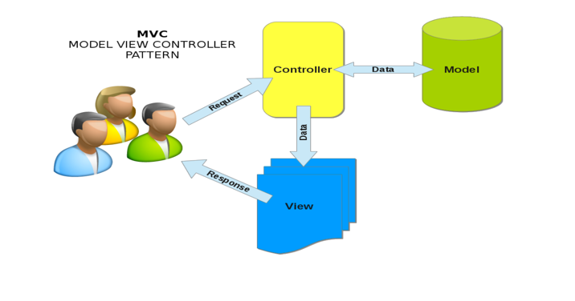

# Servlet Context
> Servlet context는 웹 애플리케이션에서 사용되는 객체로, 웹 애플리케이션 전역에서 공유되는 데이터를 저장하고 관리하는 데 사용됩니다

## 특징
1. Servlet context는 웹 애플리케이션이 시작될 때 생성되며, 웹 애플리케이션이 종료될 때까지 유지됩니다.
2. Servlet context에 저장된 데이터는 웹 애플리케이션 전체에서 공유되며, 서블릿 간의 데이터 공유에 사용됩니다.
3. Servlet context는 웹 애플리케이션에 대한 정보(예: 웹 애플리케이션 이름, 버전, 경로 등)을 제공합니다.

# el 태그

# MVC 패턴
> MVC(Model-View-Controller) 패턴은 소프트웨어 개발에서 사용되는 디자인 패턴 중 하나로, 사용자 인터페이스를 구현하는 데 있어 유용한 패턴

서로의 Layer에 영향없이 상호작용하는 웹 어플리케이션을 만들 수 있는 패턴이다.
## 특징
MVC에서 Model은 어플리케이션의 정보(데이터)를 담당하며, 
View는 텍스트, 체크박스 항목 등과 같은 사용자 인 터페이스 요소를 담당하고, 
Controller는 데이터와 비즈니스 로직 사이의 상호동작 관리하며 그리고 어플리케 이션의 기능을 담당한다.

## Servlet JSP 기술의 MVC 패턴
컨트롤러는 Servlet 객체로 구현하고 뷰는 JSP 로 그리고 모델은 VO, DTO, DAO 등의 Java 객체로 구현한 MVC 기반 웹 어플리케이션 기반 웹 어플리케이션 개발 패턴이다.

