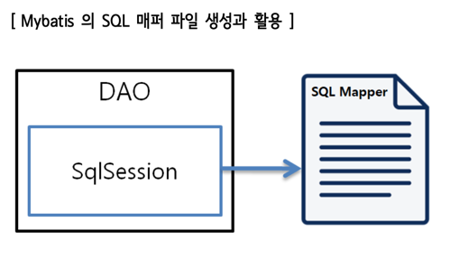
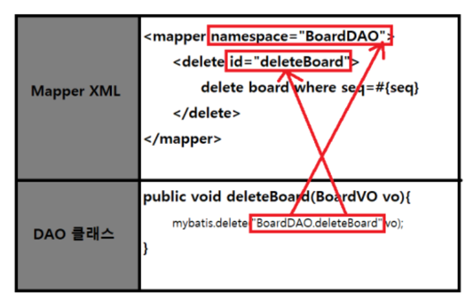
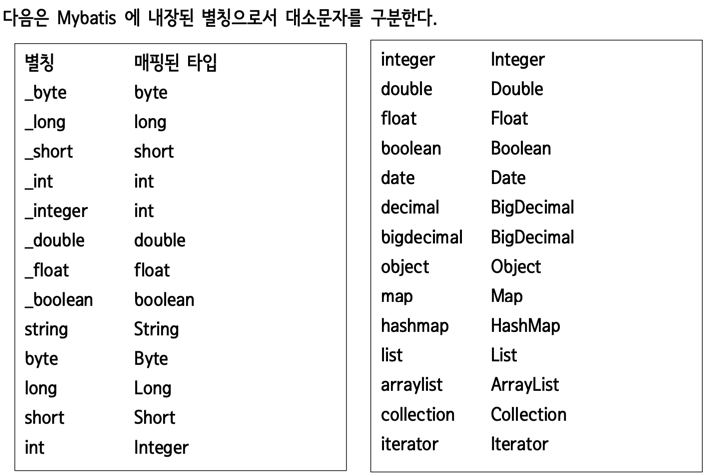

# @controller @service @repository
> 스프링MVC 에서 @Component 애노테이션의 특수한 형태이고 각각 특수한 기능을 제공합니다.

## 장점
일반적으로 @Component 를 사용해도 작동을 하지만 각각의 어노테이션마다 추가되는 기능도 있고 개발시 명확한 의미전달을 가능하게 해줍니다. 
## @Controller
@Controller 애노테이션은 스프링 MVC에서 컨트롤러 역할을 하는 클래스에 사용됩니다.<br> 
이 애노테이션은 요청을 처리하고, 모델 데이터를 생성하고, 적절한 뷰를 반환하는 등의 웹 요청 처리와 관련된 기능을 제공합니다.<br>
또한 @RequestMapping과 같은 다른 애노테이션과 함께 사용하여 URL 매핑을 지정할 수 있습니다.<br>

## @Service
@Service 애노테이션은 비즈니스 로직을 담당하는 서비스 클래스에 사용됩니다.<br>
이 애노테이션은 주로 트랜잭션 관리, 비즈니스 로직 실행, 데이터 액세스 계층과의 상호작용 등을 포함한 서비스 레이어의 구현을 지원합니다.<br>

## @Repository
@Repository 애노테이션은 데이터 액세스 계층에 해당하는 클래스에 사용됩니다.<br> 
이 애노테이션은 주로 데이터베이스와의 상호작용을 담당하는 DAO(Data Access Object) 클래스를 표시하고, 예외 변환과 트랜잭션 관리 등의 데이터 액세스 관련 기능을 제공합니다.<br>
---

# 주입받는 bean 이 여러개인 경우의 처리법
여러 개의 구현체가 있는 인터페이스를 @Autowired로 주입받을 때, 스프링은 어떤 구현체를 주입해야 하는지 결정하기 위해 추가적인 방법이 필요합니다. 
기본적으로 스프링은 여러 개의 후보 중에서 주입할 빈을 선택하는 방법을 제공합니다.

## 방법1. @Primary 애노테이션
@Primary 애노테이션은 여러 개의 후보 중에서 기본적으로 주입할 빈을 지정할 때 사용됩니다.<br>
@Primary 애노테이션이 설정된 빈은 우선적으로 주입되며, 다른 후보 빈보다 우선순위가 높습니다.<br>

예시:
````java
public interface MessageProvider {
    String getMessage();
}

@Component
@Primary
public class DefaultMessageProvider implements MessageProvider {
    @Override
    public String getMessage() {
        return "Default Message";
    }
}

@Component
public class SpecialMessageProvider implements MessageProvider {
    @Override
    public String getMessage() {
        return "Special Message";
    }
}
````
## 방법2. @Qualifier 애노테이션
@Qualifier 애노테이션은 @Autowired와 함께 사용하여 특정한 빈을 선택적으로 주입받을 때 사용됩니다.

예시:
```java
@Autowired
@Qualifier("default")
private MessageProvider messageProvider;

public interface MessageProvider {
    String getMessage();
}

@Component
@Qualifier("default")
public class DefaultMessageProvider implements MessageProvider {
    @Override
    public String getMessage() {
        return "Default Message";
    }
}

@Component
@Qualifier("special")
public class SpecialMessageProvider implements MessageProvider {
    @Override
    public String getMessage() {
        return "Special Message";
    }
}
```

## 방법3. 동적으로 주입받기
@Autowired 로 List 형식의 bean을 주입받고 클라이언트의 요청에 따라 알맞은 bean을 선택한뒤 사용합니다.

예시
```java
public interface PaymentProvider {
    void processPayment();
}

@Component("kakaoPay")
public class KakaoPay implements PaymentProvider {
    public void processPayment() {
        System.out.println("Processing payment with KakaoPay");
    }
}

@Component("naverPay")
public class NaverPay implements PaymentProvider {
    public void processPayment() {
        System.out.println("Processing payment with NaverPay");
    }
}

@Controller
public class PaymentController {
    private final List<PaymentProvider> paymentProviders;

    @Autowired
    public PaymentController(List<PaymentProvider> paymentProviders) {
        this.paymentProviders = paymentProviders;
    }

    @GetMapping("/payment")
    public void processPayment(@RequestParam("provider") String provider) {
        PaymentProvider selectedProvider = null;
        for (PaymentProvider providerBean : paymentProviders) {
            if (providerBean.getClass().getSimpleName().equalsIgnoreCase(provider)) {
                selectedProvider = providerBean;
                break;
            }
        }

        if (selectedProvider != null) {
            selectedProvider.processPayment();
        } else {
            throw new IllegalArgumentException("Invalid payment provider");
        }
    }
}
```
---
# MyBatis

## 특징
- 간단하다 : 간단한 퍼시스턴스 프레임워크
- 생산성 :62%정도 줄어드는 코드 , 간단한 설정, 예외 처리도 선택적 - SQL문이 애플리케이션 소스 코드로부터 완전 분리
  - SQL쿼리 변경 시마다 자바코드를 수정하거나 따로 컴파일 할 필요가 없다.
  - SQL의 체계적인 관리, 선언적 정의(설정 파일, 애노테이션)
- 자바 객체와 SQL 입출력 값의 투명한 바인딩
- 동적 SQL 조합
- 이식성 : 어떤 프로그래밍 언어로도 구현가능 (자바,C#,.NET,RUBY) - 오픈소스이며 무료이다.

## MyBatis 는 한마디로 간단하게 어떻게 표현해야할까?
Mybatis는 SQL과 객체를 매핑하기 위한 'SQL Mapper'라고 부르는 것이 정확한 표현이다.

## MyBatis 사용법
1. build.gradle 의 dependencies 항목에 다음에 제시된 API 의존성 정보를 추가한다.
```java
implementation 'org.mybatis.spring.boot:mybatis-spring-boot-starter:2.3.0'
```
2. application.properties 파일에 정보를 추가한다.
````java
mybatis.mapper-locations: mybatis/mapper/*.xml 
mybatis.type-aliases-package=com.example.springedu.domain
````
3. DB 와 통신할 때 사용되는  Mapper 인터페이스 또는 생성하고 정의한다.
4. SqlSession 객체를 이용하여 정의한 Mapper 파일을 이용해서 SQL 문을 실행하고 결과 데이터를 받는다.



예시



반환타입예시


---

# MyBatis 의 두가지 사용법

## XML기반의 MyBatis 
XML 기반의 MyBatis는 마이바티스 설정과 SQL 문을 XML 파일에 작성하여 관리하는 방식입니다. 개발자는 XML 파일을 사용하여 SQL 매핑과 관련된 설정을 정의하고, SQL 문을 작성합니다. 이때 XML 파일은 마이바티스의 설정 파일에 등록되어 사용됩니다.

XML 기반의 MyBatis는 다음과 같은 특징을 가지고 있습니다:

- SQL 문과 Java 코드가 분리되어 관리되므로, 복잡한 SQL 문을 보다 명확하게 작성할 수 있습니다.
- 유지보수 및 변경이 용이하며, SQL 문의 변경이나 조건 로직의 수정이 XML 파일에서 이루어질 수 있습니다.
- 동적 SQL을 작성하기 위한 태그와 기능을 XML에서 제공하여 유연한 쿼리 작성이 가능합니다.
- XML 파일을 통해 고급 매핑 기능, 결과 매핑, 캐싱 등 다양한 마이바티스 기능을 사용할 수 있습니다.
## Annotation 기반의 MyBatis
Annotation 기반의 MyBatis는 Java 어노테이션을 사용하여 SQL 문과 매핑을 직접 지정하는 방식입니다. 개발자는 인터페이스에 어노테이션을 사용하여 SQL 문을 정의하고, 필요한 경우 매개변수나 반환 타입을 지정합니다. 이때 XML 파일을 사용하지 않고, 인터페이스와 어노테이션의 조합만으로 SQL 매핑을 처리합니다.

Annotation 기반의 MyBatis는 다음과 같은 특징을 가지고 있습니다:

- XML 파일을 작성할 필요 없이 Java 어노테이션만으로 SQL 매핑을 직접 지정할 수 있습니다.
- 코드 기반으로 SQL 매핑을 정의하므로, 작성해야 할 파일의 수를 줄일 수 있습니다.
- 간단하고 직관적인 코드로 SQL 문을 작성할 수 있으며, 컴파일 시점에 오류를 검출할 수 있습니다.
- 유지보수가 쉽고 가독성이 좋으며, SQL 문이 변경되는 경우에도 바로 적용할 수 있습니다.
- XML 파일의 동적 SQL 기능과 유사한 어노테이션을 제공하여 동적 쿼리 작성이 가능합니다.